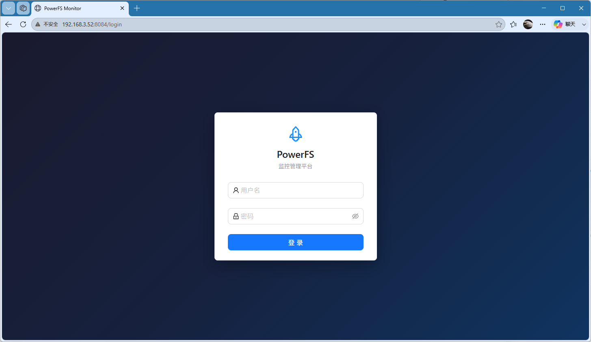
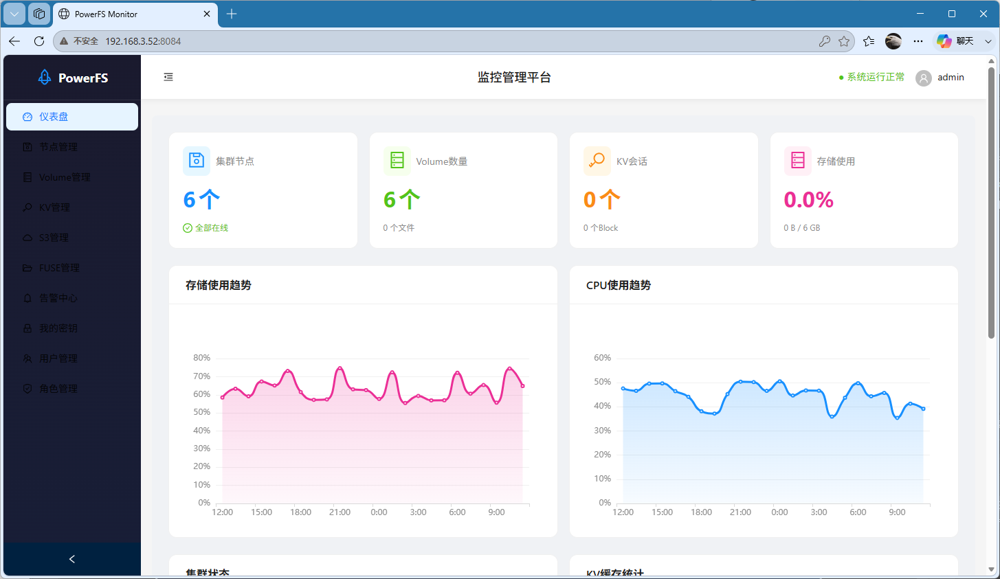
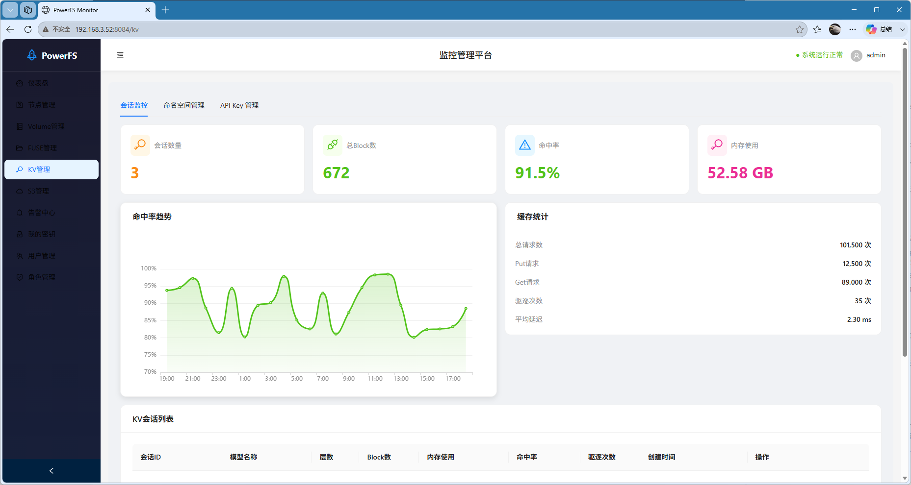

# README.md

PowerFS

**Next-Gen Zero-Jitter Unified Storage for HPC + AI Converged Clusters**

[Introduction](https://github.com/powerfs/powerfs/tree/master#introduction) • [Architecture](https://github.com/powerfs/powerfs/tree/master#architecture) • [Core Features](https://github.com/powerfs/powerfs/tree/master#core-features) • [Roadmap](https://github.com/powerfs/powerfs/tree/master#roadmap) • [Scenarios](https://github.com/powerfs/powerfs/tree/master#application-scenarios) • [Benchmark](https://github.com/powerfs/powerfs/tree/master#benchmark) • [License](https://github.com/powerfs/powerfs/tree/master#license)

---

## 🚩 Core Pain Points Solved

Traditional converged clusters are forced to run **three isolated storage stacks**, resulting in high cost, data silos and low GPU utilization:

- **HPC storage (Lustre/BeeGFS)**: Great for large sequential I/O, poor for random tiny KV I/O, severe inference jitter
- **Cloud/AI storage (Ceph/CubeFS)**: Flexible object storage, lacks complete POSIX semantics and massive parallel capability
- **Independent KV cache (Redis/local SSD)**: Extra operation burden, cannot unify data lifecycle

**PowerFS terminates the multi-stack fragmentation** with one unified architecture.

---

## Introduction

**PowerFS** is a **rust-from-scratch, zero-jitter unified parallel file system** designed exclusively for the new HPC + AI converged infrastructure. It eliminates the decades-old industry dilemma: **HPC file systems are bad at AI inference KV cache, and AI/cloud storage cannot sustain large-scale HPC parallel I/O**.

By introducing **protocol-agnostic data layer + three-interface unified architecture + OR-Set CRDT weak consistency**, PowerFS unifies POSIX / S3 / KV in one single cluster, delivering stable HPC simulation throughput and ultra-low-latency LLM inference cache performance at the same time.

Traditional storage solutions face obvious bottlenecks in converged HPC and AI scenarios. Professional HPC file systems suffer from complex deployment, heavy operation and maintenance, severe I/O jitter and poor small-file performance, and cannot adapt to AI inference workloads. Common cloud-native storage lacks massive parallel computing capability and native LLM KV cache support, resulting in insufficient overall cluster resource utilization.

PowerFS innovates a **dual-engine fusion architecture of parallel file storage and native KV cache**, with an **OR-Set CRDT based eventual consistency model** that ensures zero data loss under concurrent conflicts while enabling write-zero-blocking and unlimited client scaling without broadcast storms. It unifies traditional HPC scientific computing, large-scale parallel simulation, AI dataset training and LLM inference cache services into one storage stack.

---

## Core Design Philosophy

- **Pure Rust Stack**: Complete user-state I/O implementation, no GC jitter, memory safety, ultra-stable latency under long-time high load
- **Protocol-Agnostic Data Layer**: All file, object, and KV data lands on a unified `Needle` binary format, stored once, shared everywhere
- **OR-Set Eventual Consistency**: Default weak consistency with conflict-not-lost guarantee; concurrent writes all preserved, intelligently merged via Auto/Manual/AI three-tier modes
- **Write-Zero-Blocking**: Local OR-Set cache returns success immediately, async delta sync to Meta cluster, no cross-node RPC waiting
- **Unlimited Client Scaling**: Incremental delta sync replaces global broadcast invalidation, no performance degradation as clients grow
- **Three-Interface Unified**: Native FUSE/POSIX + KV + S3 interfaces, one data pool for all workloads
- **Full Hardware Offloading**: Native adaptation to SPDK, RDMA and GPU Direct, end-to-end zero-copy hardware acceleration
- **Lightweight Enterprise-Grade**: Simplified architecture, linear horizontal scaling, low operation and maintenance costs, enterprise-level high availability and fault tolerance

---

## Core Features

### ⚡ Extreme HPC Parallel Capability

- Distributed sharded metadata architecture, supporting 10,000+ MPI process concurrent read and write
- POSIX-compatible via projection layer (primary version visible, conflict copies in `.conflicts/`), compatible with mainstream HPC simulation software and parallel computing frameworks
- Adaptive file striping and multi-node aggregated I/O, supporting PB-level cluster aggregated bandwidth
- Fine-grained job-level QoS and I/O isolation, eliminating resource preemption and ensuring zero-jitter steady-state operation
- Optimized ultra-large directory and massive small-file scenarios, solving traditional HPC storage small-file performance bottlenecks

### 🧠 Native LLM KV Cache Engine (Industry Exclusive)

- Built-in dedicated KV tensor storage engine, no third-party components, deeply optimized for LLM inference characteristics
- O(1) constant-time KV addressing, microsecond-level access latency, supporting incremental update and partial overwriting
- Dual elimination strategy of LRU hot and cold sorting + TTL session expiration, realizing intelligent cache automatic management
- Session-level cache isolation and hot data resident mechanism, greatly improving long-text inference token generation throughput
- Native GPU Direct zero-copy transmission, extending GPU HBM video memory with NVMe storage to completely solve LLM inference video memory bottlenecks

### 🪣 S3 Object Interface

- Standard S3 protocol compatibility, version management, multi-part upload, perfect for AI dataset storage, model snapshot and batch data archiving
- Native S3 Gateway built into PowerFS Master, supporting AWS CLI/SDK and S3 Browser
- Object data stored in distributed Volume Server nodes using unified Needle format

### 🔄 OR-Set CRDT Consistency Engine (Industry Exclusive)

- OR-Set (Observed-Remove Set) CRDT directory cache, `(name+client+seq)` unique identity, concurrent writes all preserved without silent overwrite
- Five conflict scenarios fully covered: CreateCreate / WriteWrite / WriteUnlink / DeleteCreate / Rename, all conflicts retained not lost
- Three-tier merge modes: Auto (policy-based automatic) / Manual (human confirmation) / AI (intelligent content merge - future)
- POSIX projection layer: primary version visible by default, conflict copies in `.conflicts/` hidden directory, compatible with standard Unix tools
- Cross-node refresh on demand: `user.fs.need_sync` xattr + incremental/full refresh API for strong-view-consistency when needed
- Async delta sync: default 2s incremental + 30s full alignment, no global broadcast storm, unlimited client scaling

### 🚀 Ultra-Low Latency Hardware Acceleration

- SPDK user-state NVMe bare disk I/O, bypassing kernel file system and system call overhead, maximizing hardware IOPS and bandwidth
- Full-link RDMA lossless network instead of TCP, eliminating network soft interrupts and kernel protocol stack overhead
- Dual-client mode: lightweight FUSE user client + high-performance Linux kernel client
- No periodic jitter caused by runtime GC, stable p99/p999 latency under full-load cluster

### 🛠 Lightweight & Highly Available OPS

- Stateless master scheduling cluster based on Raft consensus, no single point of failure, unlimited horizontal scaling
- Rack-aware topology scheduling, realizing local I/O and intelligent data load balancing
- Dual storage engine of multi-replica & EC erasure coding, adaptive hot and cold data hierarchical storage
- Automatic node/disk fault detection, data migration and cluster self-healing
- Simplified deployment and operation, significantly lower maintenance costs than traditional Lustre/BeeGFS

---

## Architecture

PowerFS adopts a **three-layer decoupled, OR-Set CRDT weak-consistency, three-interface unified** overall architecture, realizing complete separation of control plane and data plane:

### 3-Layer Decoupled Architecture

1. **OR-Set CRDT Weak-Consistency Metadata Layer (Core)**: The heart of PowerFS architecture. Lockless OR-Set CRDT directory cache with `(name+client+seq)` unique identity, concurrent writes all preserved without silent overwrite. Eliminates broadcast storm via incremental delta sync, enabling unlimited client linear scaling. Native multi-protocol metadata isolation for POSIX/KV/S3.

2. **Raft Global Scheduling Layer**: High availability cluster providing the underlying consistency guarantee for the CRDT layer, responsible for cluster topology management, resource allocation and conflict policy management. It only maintains global metadata mapping without storing massive business data.

3. **Multi-Interface Unified Data Layer**: Unified protocol-agnostic volume using `Needle` binary format, natively integrates FUSE/POSIX + KV + S3 three interfaces, one data pool for all workloads.
   - **HPC Parallel File Engine**: Optimized for supercomputing simulation, large-file parallel reading and writing, and scientific computing batch workloads
   - **AI Native KV Cache Engine**: Dedicatedly optimized for LLM training and inference KV tensor high-speed cache scenarios
   - **S3 Object Storage Engine**: Standard S3 protocol compatibility for AI dataset storage, model snapshot and batch data archiving

### Hardware Acceleration

Native integration of SPDK NVMe user-state I/O, RDMA lossless network and GPU Direct zero-copy transmission, fully releasing the performance of NVMe SSD, high-speed network and GPU heterogeneous computing resources.

---

## 📌 Advantage Comparison

|Storage Type|HPC Parallel Stability|AI KV Inference Performance|Multi-Protocol Consistency|Jitter Control|
|---|---|---|---|---|
|Lustre/BeeGFS|Excellent|Poor|Single protocol|Medium jitter|
|Ceph/CubeFS|Weak|Medium|Fake multi-protocol|High jitter|
|**PowerFS**|**Excellent**|**Excellent**|**True unified multi-protocol**|**Zero jitter**|

---

## Application Scenarios

- **HPC Supercomputing**: Fluid dynamics, meteorology, material simulation, large-scale MPI parallel jobs
- **AI Training Cluster**: Massive dataset storage, high-throughput model reading/writing, model file persistent storage
- **LLM Inference Cluster**: Long-context KV cache acceleration, GPU memory overflow offloading, high-concurrency inference service optimization
- **HPC+AI Converged Data Center**: Unified storage resource pooling, isolated coexistence of supercomputing and intelligent computing workloads

---

## ⚡ Performance Highlights

- Single-node bandwidth: **>3GB/s**
- 4KB random write IOPS: **624,000+**
- Full-load p99/p999 latency stable, no jitter
- GPU utilization increased from 40%~50% to 90%+ for LLM inference

---

## Benchmark

### FIO Performance Test Results

All tests are conducted on a single-node setup with PowerFS FUSE client, using standard `fio` benchmark tool.

#### Test Environment
- **Hardware**: Single node with NVMe SSD
- **Block Size**: 4KB (random), 1MB (sequential)
- **Test Size**: 100MB per test
- **IO Engine**: `sync` (standard POSIX I/O)

#### Async Mode (Without fsync - Cached Writes)

| Test Type | Block Size | IOPS | Bandwidth | Avg Latency |
|-----------|------------|------|-----------|-------------|
| Sequential Write | 1MB | 3,448 | 3,448 MiB/s | 258 usec |
| Sequential Read | 1MB | 480 | 481 MiB/s | 2,072 usec |
| Random Write | 4KB | 624,000 | 2,439 MiB/s | 1.3 usec |
| Random Read | 4KB | 7,132 | 27.9 MiB/s | 139 usec |
| Mixed Read/Write (70%/30%) | 4KB | 9,846 | 38.5 MiB/s | - |

#### Sync Mode (With fsync - Persistent Writes)

| Test Type | Block Size | IOPS | Bandwidth | Avg Latency | fsync Latency |
|-----------|------------|------|-----------|-------------|--------------|
| Sequential Write | 1MB | 213 | 214 MiB/s | 460 usec | 3,279 usec |
| Sequential Read | 1MB | 480 | 481 MiB/s | 2,072 usec | - |
| Random Write | 4KB | 770 | 3.1 MiB/s | 10 usec | 1,279 usec |
| Random Read | 4KB | 7,184 | 28.1 MiB/s | 138 usec | - |
| Mixed Read/Write (70%/30%) | 4KB | 1,605 | 6.3 MiB/s | - | 643 usec |

#### Multi-thread Performance (4 Threads)

| Test Type | Block Size | IOPS | Bandwidth | Avg Latency |
|-----------|------------|------|-----------|-------------|
| Sequential Write (fsync) | 1MB | 365 | 366 MiB/s | 516 usec |
| Random Read | 4KB | 23,300 | 91.2 MiB/s | 169 usec |

#### Key Insights

- **Async Write Performance**: Random writes reach 624K IOPS with cached writes, demonstrating excellent write buffer efficiency
- **Sync Write Performance**: Limited by gRPC round-trip and disk fsync (~1.3ms), typical for network-attached storage
- **Multi-thread Scaling**: Random read scales to 23.3K IOPS with 4 threads, showing effective parallel processing
- **Data Integrity**: All tests passed `--verify=crc32c` validation, confirming data correctness

### Benchmark Outlook

PowerFS targets leading performance among mainstream open-source distributed storage systems, with core advantages as follows:

- **vs General Cloud-Native Storage**: Higher parallel computing concurrency, lower steady-state jitter, native KV cache AI acceleration capability
- **vs Traditional HPC File System**: Lighter architecture, lower O&M cost, better small-file performance, natively adapted to AI inference scenarios
- **vs Lightweight Distributed Storage**: Complete POSIX HPC semantics, enterprise-level high availability and QoS isolation, professional supercomputing cluster carrying capacity

---

## Getting Started

### Prerequisites

- Rust 1.70+ (with cargo)
- Protobuf compiler (`protoc`)
- FUSE development libraries (for FUSE client)
- Linux kernel headers (for FUSE)

#### Ubuntu/Debian

```bash
sudo apt-get update && sudo apt-get install -y \
    protobuf-compiler \
    libfuse-dev \
    linux-headers-generic
```

#### CentOS/RHEL

```bash
sudo yum install -y \
    protobuf-compiler \
    fuse-devel
```

### Build

```bash
# Clone the repository
git clone https://github.com/powerfs/powerfs.git
cd powerfs

# Build all packages
cargo build --all

# Build in release mode
cargo build --all --release

# Build and install to PATH
cargo install --path powerfs-server
```

### Quick Start

Run PowerFS similar to SeaweedFS:

```bash
# Step 1: Start master node (default port 9333, S3 Gateway on port 9000)
powerfs master

# Step 2: Start volume node connected to master
powerfs volume -m localhost:9333

# Step 3: Mount FUSE filesystem
powerfs mount -d /mnt/powerfs -m localhost:9333
```

### Run

#### Start Master Node

```bash
# Start master node with default settings
powerfs master

# Start with custom port and directory
powerfs master -p 9333 -d /data/master

# Separate raft and meta directories (for production)
powerfs master -d /data/master -r /fast-ssd/raft -m /fast-ssd/meta

# Bind to specific IP
powerfs master -p 9333 -i 192.168.1.100
```

#### Start Volume Node

```bash
# Start volume node with minimal configuration
powerfs volume -m localhost:9333

# Start with custom settings
powerfs volume -p 8080 -d /data/volume -m localhost:9333

# Separate meta and data directories (for production)
# Meta on fast SSD, data on large capacity disk
powerfs volume -d /data/vol1 \
    -m /fast-ssd/vol1/meta \
    -d /big-disk/vol1/data \
    -m localhost:9333

# Bind to specific IP with custom max volume size
powerfs volume -p 8080 -i 192.168.1.101 -d /data/volume -m localhost:9333 -s 2147483648
```

#### Start S3 Gateway

S3 Gateway is built into the Master node and starts automatically on port 9000 when the master runs. You can configure it with the following options:

```bash
# Start master with S3 Gateway on custom port
powerfs master -p 9333 --s3-port 9000

# Bind S3 Gateway to specific IP
powerfs master --s3-ip 192.168.1.100
```

#### Mount FUSE Filesystem

```bash
# Mount PowerFS to /mnt/powerfs
powerfs mount -d /mnt/powerfs

# Mount with master connection
powerfs mount -d /mnt/powerfs -m localhost:9333

# Alternative: use fuse command
powerfs fuse -d /mnt/powerfs -m localhost:9333
```

### Docker Deployment (Recommended)

PowerFS provides a convenient Docker deployment script for quickly starting a multi-node cluster:

```bash
# Clone the repository
git clone https://github.com/powerfs/powerfs.git
cd powerfs

# Build and start the cluster
./docker/scripts/start-cluster.sh -b

# Stop the cluster
./docker/scripts/stop-cluster.sh
```

**Parameters**:
- `-b` or `--build`: Rebuild Docker images before starting
- Without `-b`: Use existing Docker images

**Services**:
| Service | Address |
|---------|---------|
| Monitor UI | http://localhost:8084 |
| Monitor API | http://localhost:8083 |
| Master Nodes | localhost:9333, 9334, 9335 |
| Volume Nodes | localhost:8080, 8081, 8082 |
| Redis | localhost:6379 |
| S3 Backend | http://localhost:9000 |

### Login Information

**Default Credentials**:
- **Username**: `admin`
- **Password**: `admin123`

**S3 Credentials**:
- **Access Key**: `powerfs`
- **Secret Key**: `powerfs123`
- **Endpoint**: http://localhost:9000

### Web Dashboard

#### Login Page



The login page provides secure access to the monitoring dashboard. Use the default credentials to log in.

#### Dashboard



The main dashboard displays system overview including cluster health status, volume node statistics, active sessions, and recent alerts.

#### KV Management



The KV management page allows you to create and manage namespaces, monitor session activity, view cache statistics and hit rates, and create API access keys.

### Directory Structure

PowerFS uses a hierarchical directory structure to separate different types of data:

```
# Master Node Directory Structure
/data/master/
├── raft/           # Raft consensus log (can be on fast SSD)
│   ├── wal/        # Write-Ahead Log
│   └── snapshot/   # State snapshots
└── meta/           # RocksDB metadata (cluster topology, volume mapping)
    └── *.sst        # RocksDB SST files

# Volume Node Directory Structure
/data/volume/
├── meta/           # RocksDB metadata (volume info, needle index)
│   └── *.sst       # RocksDB SST files
└── data/           # Actual file data (can be on large capacity disk)
    └── volume_{id}/
        ├── data    # Volume data file
        └── index   # Volume index
```

**Directory Separation Benefits:**
- Place raft logs on fast SSD for better consensus performance
- Place metadata on fast SSD for quick lookups
- Place data files on large capacity disks

### Command Line Options

```bash
PowerFS - Zero-jitter unified parallel file system

Usage: powerfs [OPTIONS] <COMMAND>

Commands:
  master   Start master node (port: 9333, S3 Gateway: 9000, dir: ./data/master)
  volume   Start volume node (port: 8080, dir: ./data/volume)
  fuse     Mount FUSE filesystem
  mount    Mount filesystem (alias for fuse)
  help     Print this message or the help of the given subcommand(s)

Options:
      --log-level <LOG_LEVEL>  Log level [default: info]
  -h, --help                   Print help
  -V, --version                Print version

Master Options:
  -p, --port <PORT>    Master port [default: 9333]
  -d, --dir <DIR>      Data directory [default: ./data/master]
  -r, --raft-dir       Raft log directory [default: <dir>/raft]
  -m, --meta-dir       Meta storage directory [default: <dir>/meta]
  -i, --ip <IP>        Bind IP address
      --s3-port <PORT> S3 Gateway port [default: 9000]
      --s3-ip <IP>     S3 Gateway bind IP

Volume Options:
  -p, --port <PORT>           Volume port [default: 8080]
  -d, --dir <DIR>             Data directory [default: ./data/volume]
  -m, --meta-dir              Meta storage directory [default: <dir>/meta]
  -d, --data-dir              Data storage directory [default: <dir>/data]
      --master <MASTER>       Master address
  -i, --ip <IP>               Bind IP address
  -s, --max-volume-size <MAX_VOLUME_SIZE>  Max volume size in bytes [default: 1073741824]

Mount/Fuse Options:
  -d, --dir <DIR>      Mount directory
      --master <MASTER>  Master address
```

### Run Tests

```bash
# Run all tests
cargo test --all

# Run tests for specific package
cargo test -p powerfs-core

# Run storage benchmark tests
cargo test -p powerfs-core --test storage_benchmark_test -- --nocapture
```

### Architecture Overview

```
┌─────────────────────────────────────────────────────────────┐
│                      Client Layer                           │
│  ┌──────────┐  ┌──────────┐  ┌──────────────────────────┐  │
│  │  FUSE    │  │    S3    │  │      KV Cache Client     │  │
│  │ (POSIX)  │  │  Client  │  │  (for LLM Inference)     │  │
│  └────┬─────┘  └────┬─────┘  └───────────┬──────────────┘  │
└───────┼──────────────┼───────────────────┼─────────────────┘
        │              │                   │
┌───────▼──────────────▼───────────────────▼─────────────────┐
│      OR-Set CRDT Weak-Consistency Metadata Layer (Core)    │
│  ┌──────────────────────────────────────────────────────┐  │
│  │  Lockless Cache | Delta Sync | Conflict Merge        │  │
│  │  Multi-Protocol Isolation (POSIX/KV/S3)              │  │
│  └──────────────────────────────────────────────────────┘  │
└──────────────────────┬─────────────────────────────────────┘
                       │
┌──────────────────────▼─────────────────────────────────────┐
│         Raft Global Scheduling Layer                        │
│              (High-Availability Cluster)                    │
│  ┌──────────────────────────────────────────────────────┐  │
│  │  Cluster Management | Resource Allocation | Topology │  │
│  └──────────────────────────────────────────────────────┘  │
└──────────────────────┬─────────────────────────────────────┘
                       │
┌──────────────────────▼─────────────────────────────────────┐
│         Multi-Interface Unified Data Layer                  │
│  ┌──────────────┐  ┌──────────────┐  ┌──────────────┐     │
│  │  Volume 1    │  │  Volume 2    │  │  Volume N    │     │
│  │  (8080)      │  │  (8081)      │  │  (8xxx)      │     │
│  └──────────────┘  └──────────────┘  └──────────────┘     │
│        [Unified Needle Binary Format]                      │
└─────────────────────────────────────────────────────────────┘
```

---

## 🚀 Roadmap

- **Phase 1**: OR-Set weak-consistency cache, full conflict diversion & auto merge
- **Phase 2**: On-demand strong sync, complete multi-protocol semantic isolation
- **Phase 3**: AI intelligent conflict merge, full-autonomous storage governance

---

## 🤝 Community & Contribution

PowerFS is open-source under Apache 2.0 license. We are committed to building the **next-generation unified storage infrastructure for HPC + AI converged computing**.

Welcome Star, Fork, PR and Issue to help us evolve!

**GitHub**: https://github.com/powerfs/powerfs

---

## License

Open Source License To Be Determined (Planned: Apache 2.0 / MIT)

---

**Unify HPC & AI Storage, End the Dual-Stack Fragmentation**