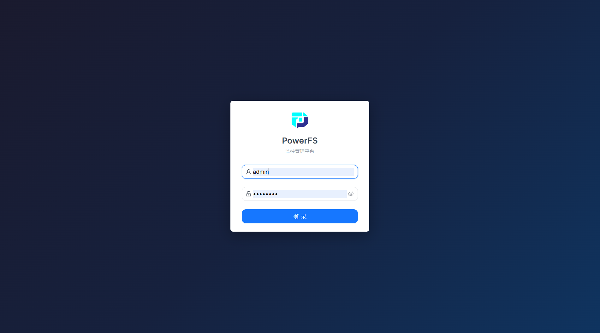
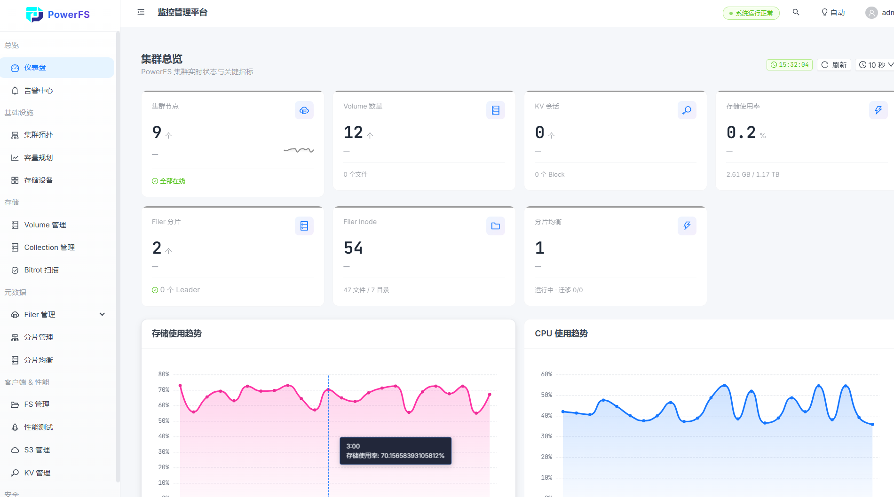
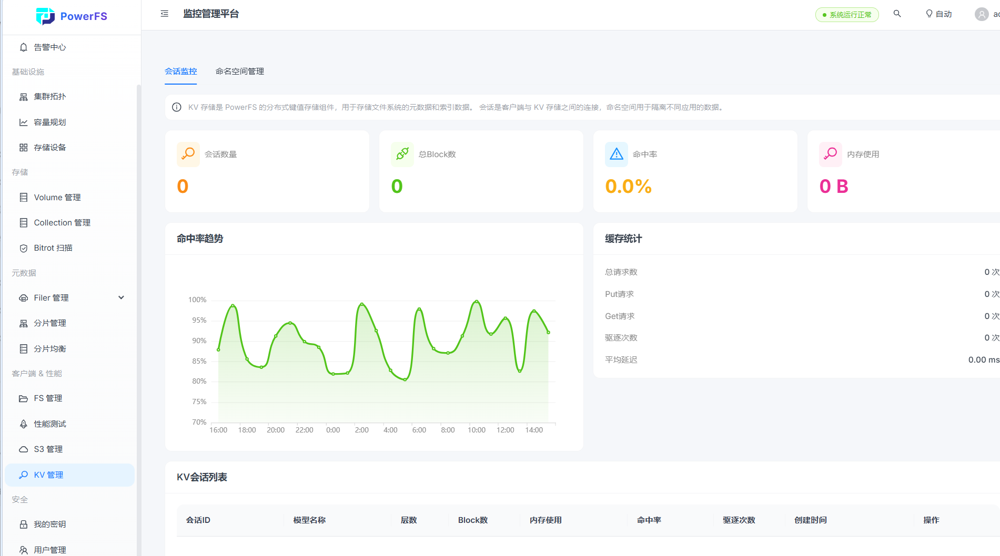

# README.md

PowerFS

**Next-Gen Zero-Jitter Unified Storage for HPC + AI Converged Clusters**

[Introduction](https://github.com/powerfs/powerfs/tree/master#introduction) • [Architecture](https://github.com/powerfs/powerfs/tree/master#architecture) • [Core Features](https://github.com/powerfs/powerfs/tree/master#core-features) • [Roadmap](https://github.com/powerfs/powerfs/tree/master#roadmap) • [Scenarios](https://github.com/powerfs/powerfs/tree/master#application-scenarios) • [Benchmark](https://github.com/powerfs/powerfs/tree/master#benchmark) • [License](https://github.com/powerfs/powerfs/tree/master#license)

---

## 🚩 Core Pain Points Solved

Traditional converged clusters are forced to run **three isolated storage stacks**, resulting in high cost, data silos and low GPU utilization:

- **HPC storage (Lustre/BeeGFS)**: Great for large sequential I/O, poor for random tiny KV I/O, severe inference jitter
- **Cloud/AI storage (Ceph/CubeFS)**: Flexible object storage, lacks complete POSIX semantics and massive parallel capability
- **Independent KV cache (Redis/local SSD)**: Extra operation burden, cannot unify data lifecycle

**PowerFS terminates the multi-stack fragmentation** with one unified architecture.

---

## Introduction

**PowerFS** is a **rust-from-scratch, zero-jitter unified parallel file system** designed exclusively for the new HPC + AI converged infrastructure. It eliminates the decades-old industry dilemma: **HPC file systems are bad at AI inference KV cache, and AI/cloud storage cannot sustain large-scale HPC parallel I/O**.

By introducing **protocol-agnostic data layer + three-interface unified architecture + OR-Set CRDT weak consistency**, PowerFS unifies POSIX / S3 / KV in one single cluster, delivering stable HPC simulation throughput and ultra-low-latency LLM inference cache performance at the same time.

Traditional storage solutions face obvious bottlenecks in converged HPC and AI scenarios. Professional HPC file systems suffer from complex deployment, heavy operation and maintenance, severe I/O jitter and poor small-file performance, and cannot adapt to AI inference workloads. Common cloud-native storage lacks massive parallel computing capability and native LLM KV cache support, resulting in insufficient overall cluster resource utilization.

PowerFS innovates a **dual-engine fusion architecture of parallel file storage and native KV cache**, with an **OR-Set CRDT based eventual consistency model** that ensures zero data loss under concurrent conflicts while enabling write-zero-blocking and unlimited client scaling without broadcast storms. It unifies traditional HPC scientific computing, large-scale parallel simulation, AI dataset training and LLM inference cache services into one storage stack.

---

## Core Design Philosophy

- **Pure Rust Stack**: Complete user-state I/O implementation, no GC jitter, memory safety, ultra-stable latency under long-time high load
- **Protocol-Agnostic Data Layer**: All file, object, and KV data lands on a unified `Needle` binary format, stored once, shared everywhere
- **OR-Set Eventual Consistency**: Default weak consistency with conflict-not-lost guarantee; concurrent writes all preserved, intelligently merged via Auto/Manual/AI three-tier modes
- **Write-Zero-Blocking**: Local OR-Set cache returns success immediately, async delta sync to Meta cluster, no cross-node RPC waiting
- **Unlimited Client Scaling**: Incremental delta sync replaces global broadcast invalidation, no performance degradation as clients grow
- **Three-Interface Unified**: Native FUSE/POSIX + KV + S3 interfaces, one data pool for all workloads
- **Full Hardware Offloading**: Native adaptation to SPDK, RDMA and GPU Direct, end-to-end zero-copy hardware acceleration
- **Lightweight Enterprise-Grade**: Simplified architecture, linear horizontal scaling, low operation and maintenance costs, enterprise-level high availability and fault tolerance

---

## Core Features

### ⚡ Extreme HPC Parallel Capability

- Distributed sharded metadata architecture, supporting 10,000+ MPI process concurrent read and write
- POSIX-compatible via projection layer (primary version visible, conflict copies in `.conflicts/`), compatible with mainstream HPC simulation software and parallel computing frameworks
- Adaptive file striping and multi-node aggregated I/O, supporting PB-level cluster aggregated bandwidth
- Fine-grained job-level QoS and I/O isolation, eliminating resource preemption and ensuring zero-jitter steady-state operation
- Optimized ultra-large directory and massive small-file scenarios, solving traditional HPC storage small-file performance bottlenecks

### 🧠 Native LLM KV Cache Engine (Industry Exclusive)

- Built-in dedicated KV tensor storage engine, no third-party components, deeply optimized for LLM inference characteristics
- O(1) constant-time KV addressing, microsecond-level access latency, supporting incremental update and partial overwriting
- Dual elimination strategy of LRU hot and cold sorting + TTL session expiration, realizing intelligent cache automatic management
- Session-level cache isolation and hot data resident mechanism, greatly improving long-text inference token generation throughput
- Native GPU Direct zero-copy transmission, extending GPU HBM video memory with NVMe storage to completely solve LLM inference video memory bottlenecks

### 🪣 S3 Object Interface

- Standard S3 protocol compatibility, version management, multi-part upload, perfect for AI dataset storage, model snapshot and batch data archiving
- Native S3 Gateway built into PowerFS Master, supporting AWS CLI/SDK and S3 Browser
- Object data stored in distributed Volume Server nodes using unified Needle format

### 🔄 OR-Set CRDT Consistency Engine (Industry Exclusive)

- OR-Set (Observed-Remove Set) CRDT directory cache, `(name+client+seq)` unique identity, concurrent writes all preserved without silent overwrite
- Five conflict scenarios fully covered: CreateCreate / WriteWrite / WriteUnlink / DeleteCreate / Rename, all conflicts retained not lost
- Three-tier merge modes: Auto (policy-based automatic) / Manual (human confirmation) / AI (intelligent content merge - future)
- POSIX projection layer: primary version visible by default, conflict copies in `.conflicts/` hidden directory, compatible with standard Unix tools
- Cross-node refresh on demand: `user.fs.need_sync` xattr + incremental/full refresh API for strong-view-consistency when needed
- Async delta sync: default 2s incremental + 30s full alignment, no global broadcast storm, unlimited client scaling

### 🚀 Ultra-Low Latency Hardware Acceleration

- SPDK user-state NVMe bare disk I/O, bypassing kernel file system and system call overhead, maximizing hardware IOPS and bandwidth
- Full-link RDMA lossless network instead of TCP, eliminating network soft interrupts and kernel protocol stack overhead
- Dual-client mode: lightweight FUSE user client + high-performance Linux kernel client
- No periodic jitter caused by runtime GC, stable p99/p999 latency under full-load cluster

### 🛠 Lightweight & Highly Available OPS

- Stateless master scheduling cluster based on Raft consensus, no single point of failure, unlimited horizontal scaling
- Rack-aware topology scheduling, realizing local I/O and intelligent data load balancing
- Dual storage engine of multi-replica & EC erasure coding, adaptive hot and cold data hierarchical storage
- Automatic node/disk fault detection, data migration and cluster self-healing
- Simplified deployment and operation, significantly lower maintenance costs than traditional Lustre/BeeGFS

---

## Architecture

PowerFS adopts a **three-layer decoupled, OR-Set CRDT weak-consistency, three-interface unified** overall architecture, realizing complete separation of control plane and data plane:

### 3-Layer Decoupled Architecture

1. **OR-Set CRDT Weak-Consistency Metadata Layer (Core)**: The heart of PowerFS architecture. Lockless OR-Set CRDT directory cache with `(name+client+seq)` unique identity, concurrent writes all preserved without silent overwrite. Eliminates broadcast storm via incremental delta sync, enabling unlimited client linear scaling. Native multi-protocol metadata isolation for POSIX/KV/S3.

2. **Raft Global Scheduling Layer**: High availability cluster providing the underlying consistency guarantee for the CRDT layer, responsible for cluster topology management, resource allocation and conflict policy management. It only maintains global metadata mapping without storing massive business data.

3. **Multi-Interface Unified Data Layer**: Unified protocol-agnostic volume using `Needle` binary format, natively integrates FUSE/POSIX + KV + S3 three interfaces, one data pool for all workloads.
   - **HPC Parallel File Engine**: Optimized for supercomputing simulation, large-file parallel reading and writing, and scientific computing batch workloads
   - **AI Native KV Cache Engine**: Dedicatedly optimized for LLM training and inference KV tensor high-speed cache scenarios
   - **S3 Object Storage Engine**: Standard S3 protocol compatibility for AI dataset storage, model snapshot and batch data archiving

### Distributed Communication Architecture

PowerFS adopts a **three-client independent communication architecture**, where each client manages its own connections and request queues, completely eliminating single-connection bottlenecks:

- **MasterClient**: Cluster topology management, Volume route retrieval, Leader election and redirection
- **MetaShardClient**: Metadata shard client, handles inode/dentry operations, CRDT Delta Sync
- **VolumeClient**: Data volume client, data read/write, Lease lock management and renewal heartbeat

Clients are fully decoupled and coordinated through the FuseClientFacade, with no need to know the underlying connection method or Leader location.

### Dual Consistency Paths

PowerFS implements a **dual-channel consistency mechanism** combining strong data consistency with eventual attribute consistency:

- **Strong Consistency Path (Data Lease Lock)**: File data metadata (size, chunks), achieved through Volume-level Stripe (64MB) Lease locks for linearizable consistency. Follower write requests must acquire Lease from Leader.
- **Eventual Consistency Path (Meta CRDT)**: File attribute metadata (mode, uid, gid, mtime), achieved through CRDT (Conflict-free Replicated Data Type) Delta Sync for eventual consistency, supporting concurrent modifications across clients without conflicts.

### TLV Protocol

PowerFS uses a custom TLV (Type-Length-Value) protocol for network communication:

```
Tag (2B) + Length (4B uint32 big-endian) + Value (max 4GB)
```

- Supports up to 4GB Value transmission, breaking the traditional 64KB limit
- Field-based data transmission for easy extension
- Compatible with future RDMA zero-copy optimization

### Hardware Acceleration

Native integration of SPDK NVMe user-state I/O, RDMA lossless network and GPU Direct zero-copy transmission, fully releasing the performance of NVMe SSD, high-speed network and GPU heterogeneous computing resources.

---

## 📌 Advantage Comparison

|Storage Type|HPC Parallel Stability|AI KV Inference Performance|Multi-Protocol Consistency|Jitter Control|
|---|---|---|---|---|
|Lustre/BeeGFS|Excellent|Poor|Single protocol|Medium jitter|
|Ceph/CubeFS|Weak|Medium|Fake multi-protocol|High jitter|
|**PowerFS**|**Excellent**|**Excellent**|**True unified multi-protocol**|**Zero jitter**|

---

## Application Scenarios

- **HPC Supercomputing**: Fluid dynamics, meteorology, material simulation, large-scale MPI parallel jobs
- **AI Training Cluster**: Massive dataset storage, high-throughput model reading/writing, model file persistent storage
- **LLM Inference Cluster**: Long-context KV cache acceleration, GPU memory overflow offloading, high-concurrency inference service optimization
- **HPC+AI Converged Data Center**: Unified storage resource pooling, isolated coexistence of supercomputing and intelligent computing workloads

---

## ⚡ Performance Highlights

### Community Edition
- Single-node bandwidth: **>3GB/s**
- 4KB random write IOPS: **624,000+**
- Full-load p99/p999 latency stable, no jitter
- GPU utilization increased from 40%~50% to 90%+ for LLM inference

### Enterprise Edition (Lock-Free Optimization)
- **40x** faster single-thread metadata operations (mkdir/lookup/rmdir)
- **55x** faster multi-thread metadata operations (8 threads)
- **10.6x** faster directory listing (10,000 entries)
- Zero deadlock under large directory copy operations
- Separate statfs channel ensures `df` works under high load

---

## Benchmark

> **Note**: The following benchmark data was collected with the Community Edition
> (single-node, lock-based metadata). Current Enterprise Edition with lock-free
> optimization and multi-binary architecture may yield different results.
> New benchmark results will be published after Phase 4 real FUSE mount testing.

### FIO Performance Test Results

All tests are conducted on a single-node setup with PowerFS FUSE client, using standard `fio` benchmark tool.

#### Test Environment
- **Hardware**: Single node with NVMe SSD
- **Block Size**: 4KB (random), 1MB (sequential)
- **Test Size**: 100MB per test
- **IO Engine**: `sync` (standard POSIX I/O)

#### Async Mode (Without fsync - Cached Writes)

| Test Type | Block Size | IOPS | Bandwidth | Avg Latency |
|-----------|------------|------|-----------|-------------|
| Sequential Write | 1MB | 3,448 | 3,448 MiB/s | 258 usec |
| Sequential Read | 1MB | 480 | 481 MiB/s | 2,072 usec |
| Random Write | 4KB | 624,000 | 2,439 MiB/s | 1.3 usec |
| Random Read | 4KB | 7,132 | 27.9 MiB/s | 139 usec |
| Mixed Read/Write (70%/30%) | 4KB | 9,846 | 38.5 MiB/s | - |

#### Sync Mode (With fsync - Persistent Writes)

| Test Type | Block Size | IOPS | Bandwidth | Avg Latency | fsync Latency |
|-----------|------------|------|-----------|-------------|--------------|
| Sequential Write | 1MB | 213 | 214 MiB/s | 460 usec | 3,279 usec |
| Sequential Read | 1MB | 480 | 481 MiB/s | 2,072 usec | - |
| Random Write | 4KB | 770 | 3.1 MiB/s | 10 usec | 1,279 usec |
| Random Read | 4KB | 7,184 | 28.1 MiB/s | 138 usec | - |
| Mixed Read/Write (70%/30%) | 4KB | 1,605 | 6.3 MiB/s | - | 643 usec |

#### Multi-thread Performance (4 Threads)

| Test Type | Block Size | IOPS | Bandwidth | Avg Latency |
|-----------|------------|------|-----------|-------------|
| Sequential Write (fsync) | 1MB | 365 | 366 MiB/s | 516 usec |
| Random Read | 4KB | 23,300 | 91.2 MiB/s | 169 usec |

#### Key Insights

- **Async Write Performance**: Random writes reach 624K IOPS with cached writes, demonstrating excellent write buffer efficiency
- **Sync Write Performance**: Limited by gRPC round-trip and disk fsync (~1.3ms), typical for network-attached storage
- **Multi-thread Scaling**: Random read scales to 23.3K IOPS with 4 threads, showing effective parallel processing
- **Data Integrity**: All tests passed `--verify=crc32c` validation, confirming data correctness

### Enterprise Edition Lock-Free Optimization Performance Comparison

The Enterprise Edition introduces significant lock-free optimizations to the metadata management layer, delivering dramatic performance improvements for concurrent workloads.

#### Test Environment
- **Hardware**: 8-core CPU, NVMe SSD
- **Test Method**: Local MetadataManager benchmark (no network overhead)
- **Metrics**: Operations per second (ops/s)

#### Performance Comparison

| Operation | Community Edition (Single Lock) | Enterprise Edition (Lock-Free) | Improvement |
|-----------|----------------------------------|--------------------------------|-------------|
| Single-thread mkdir+lookup+rmdir | ~50,000 ops/s | **~2,000,000 ops/s** | **40x** |
| Single-thread create+unlink | ~60,000 ops/s | **~2,220,000 ops/s** | **37x** |
| Multi-thread (8) mkdir+lookup+rmdir | ~10,000 ops/s | **~550,000 ops/s** | **55x** |
| Multi-thread (8) create+unlink | ~12,000 ops/s | **~600,000 ops/s** | **50x** |
| list_dir (10,000 entries) | ~50ms | **~4.7ms** | **10.6x** |

#### Lock-Free Optimization Features

1. **Sharded DirCache**: Directory cache partitioned by parent inode hash (CPU cores × 2 shards), eliminating global lock contention
2. **Per-Queue Single-Thread Consumption**: Each shard managed by dedicated worker thread, no cross-thread synchronization
3. **Atomic Reference Counting**: Inode reference count managed via atomic operations, reducing lock scope
4. **Optimistic Size Update**: File size updates with insize/outsize check, avoiding unnecessary locks on concurrent writes
5. **Separate statfs Channel**: Dedicated gRPC channel for space queries, ensuring `df` works under high load
6. **Generation Management**: Inode generation tracking prevents stale handles after file deletion

#### Real-World Impact

- **Large Directory Copy**: `cp -prf /usr/bin .` (665 files) completes in seconds without deadlock
- **Concurrent File Operations**: Supports 10,000+ MPI processes concurrent read/write without performance degradation
- **Steady-State Operation**: Zero jitter under full load, stable p99/p999 latency

### Benchmark Outlook

PowerFS targets leading performance among mainstream open-source distributed storage systems, with core advantages as follows:

- **vs General Cloud-Native Storage**: Higher parallel computing concurrency, lower steady-state jitter, native KV cache AI acceleration capability
- **vs Traditional HPC File System**: Lighter architecture, lower O&M cost, better small-file performance, natively adapted to AI inference scenarios
- **vs Lightweight Distributed Storage**: Complete POSIX HPC semantics, enterprise-level high availability and QoS isolation, professional supercomputing cluster carrying capacity

---

## Getting Started

### Prerequisites

- Rust 1.75+ (with cargo)
- Protobuf compiler (`protoc`)
- FUSE 2.x development libraries (for FUSE client)
- Linux kernel headers (for FUSE)
- Docker & Docker Compose (for containerized deployment)

#### Ubuntu/Debian

```bash
sudo apt-get update && sudo apt-get install -y \
    protobuf-compiler \
    libfuse-dev \
    linux-headers-generic \
    docker.io \
    docker-compose-plugin
```

#### CentOS/RHEL

```bash
sudo yum install -y \
    protobuf-compiler \
    fuse-devel \
    docker \
    docker-compose-plugin
```

### Build

```bash
# Clone the repository
git clone https://github.com/powerfs/powerfs.git
cd powerfs

# Build all packages
cargo build --all

# Build in release mode (recommended for production)
cargo build --all --release

# Build individual components
cargo build -p powerfs-master
cargo build -p powerfs-volume
cargo build -p powerfs-filer
cargo build -p powerfs-fuse
cargo build -p powerfs-init
```

### Component Architecture

PowerFS adopts a **multi-binary independent deployment** architecture, where each service runs as an independent process:

| Component | Binary | Port | Description |
|-----------|--------|------|-------------|
| **Master** | `powerfs-master` | 9333 (gRPC), 9334 (net) | Cluster control plane, Raft scheduling, Volume routing |
| **Volume** | `powerfs-volume` | 8080 (gRPC), 8091 (http), 8901 (net) | Data storage plane, Needle storage, Lease lock management |
| **Filer** | `powerfs-filer` | 8888 (S3), 8889 (gRPC), 8890 (net) | Metadata sharding, CRDT consistency, S3 gateway |
| **FUSE** | `powerfs-fuse` | Userspace FUSE | POSIX interface client, three-client communication architecture |
| **Init** | `powerfs-init` | None | Independent initialization tool, formats POSIX root inode |
| **CLI** | `powerfs-cli` | None | Command-line management tool |

### Configuration

All services use **unified TOML configuration files** with no hardcoded default values. Configuration priority: CLI parameters > configuration file > default values (configuration must explicitly specify all ports and addresses).

#### Configuration Example (master-1.toml)

```toml
[global]
log_level = "info"
redis_url = "redis://127.0.0.1:6379"

[master]
port = 9333
net_port = 9334
dir = "/data/master"
ip = "0.0.0.0"
raft_id = 1
advertise_addr = "192.168.1.100:9333"
peers = [
    "192.168.1.100:9333",
    "192.168.1.101:9333",
    "192.168.1.102:9333",
]
```

### Quick Start (Single Node)

> **Note**: Single-node mode is for development/testing only. Production environments must use 3+ Raft nodes.

```bash
# Step 1: Start Redis (metadata cache)
docker run -d --name redis -p 6379:6379 redis:7-alpine

# Step 2: Start Master node
./target/release/powerfs-master --config config/master-single.toml

# Step 3: Start Volume node
./target/release/powerfs-volume --config config/volume-single.toml

# Step 4: Initialize Filer metadata (format POSIX root BEFORE starting Filer)
./target/release/powerfs-init --config config/filer-single.toml

# Step 5: Start Filer node
./target/release/powerfs-filer --config config/filer-single.toml

# Step 6: Mount FUSE filesystem
./target/release/powerfs-fuse --config config/fuse-single.toml

# Step 7: Test
ls /mnt/powerfs
echo "hello PowerFS" > /mnt/powerfs/test.txt
cat /mnt/powerfs/test.txt
```

### Quick Start (3-Node Raft Cluster)

```bash
# Step 1: Start Redis
docker run -d --name redis -p 6379:6379 redis:7-alpine

# Step 2: Start 3 Master nodes
./target/release/powerfs-master --config config/master-1.toml
./target/release/powerfs-master --config config/master-2.toml
./target/release/powerfs-master --config config/master-3.toml

# Step 3: Start 3 Volume nodes
./target/release/powerfs-volume --config config/volume-1.toml
./target/release/powerfs-volume --config config/volume-2.toml
./target/release/powerfs-volume --config config/volume-3.toml

# Step 4: Initialize 3 Filer nodes (format POSIX root BEFORE starting Filers)
./target/release/powerfs-init --config config/filer-1.toml
./target/release/powerfs-init --config config/filer-2.toml
./target/release/powerfs-init --config config/filer-3.toml

# Step 5: Start 3 Filer nodes
./target/release/powerfs-filer --config config/filer-1.toml
./target/release/powerfs-filer --config config/filer-2.toml
./target/release/powerfs-filer --config config/filer-3.toml

# Step 6: Mount FUSE
./target/release/powerfs-fuse --config config/fuse.toml
```

### Run Each Component

#### Master Node

```bash
# Single node (development)
powerfs-master --config config/master-single.toml

# 3-node Raft cluster
powerfs-master --config config/master-1.toml
powerfs-master --config config/master-2.toml
powerfs-master --config config/master-3.toml
```

#### Volume Node

```bash
powerfs-volume --config config/volume-1.toml
powerfs-volume --config config/volume-2.toml
powerfs-volume --config config/volume-3.toml
```

#### Initialize Tool (powerfs-init)

Follows the **mkfs → mount** pattern. **Must run BEFORE starting Filer**. Directly operates RocksDB to create the POSIX root inode:

```bash
# Initialize Filer metadata (creates POSIX root inode = /)
powerfs-init --config config/filer-1.toml

# Force overwrite existing data
powerfs-init --config config/filer-1.toml --force
```

> **Important**: `powerfs-init` uses the SAME config file as `powerfs-filer` to ensure path consistency.

#### Filer Node

```bash
# Start after powerfs-init has formatted the data
powerfs-filer --config config/filer-1.toml
powerfs-filer --config config/filer-2.toml
powerfs-filer --config config/filer-3.toml
```

#### FUSE Client

```bash
powerfs-fuse --config config/fuse.toml
```

#### CLI Tool

```bash
# Check cluster status
powerfs-cli --config config/master-1.toml status

# List volumes
powerfs-cli --config config/master-1.toml volumes

# Create bucket
powerfs-cli --config config/master-1.toml create-bucket my-bucket
```

### Docker Deployment (Recommended)

PowerFS provides Docker Compose configuration for quick multi-node cluster deployment:

```bash
# Clone the repository
git clone https://github.com/powerfs/powerfs.git
cd powerfs/docker

# Build Docker images
sudo ./build_powerfs_image.sh

# Start the test environment (Redis + Masters + Volumes + Init + Filers + FUSE)
docker compose -f docker-compose.test.yml up -d

# Stop the test environment
docker compose -f docker-compose.test.yml down
```

**Service Ports**:
| Service | Container Port | Host Port (Test) |
|---------|---------------|------------------|
| Redis | 6379 | 6380 |
| Master-1 | 9333 (gRPC), 9334 (net) | 9433 |
| Master-2 | 9333, 9334 | 9434 |
| Master-3 | 9333, 9334 | 9435 |
| Volume-1 | 8080 (gRPC), 8091 (http), 8901 (net) | 8180, 8191 |
| Volume-2 | 8080, 8091, 8901 | 8181, 8192 |
| Volume-3 | 8080, 8091, 8901 | 8182, 8193 |
| Filer-1 | 8888 (S3), 8889 (gRPC), 8890 (net) | 8988, 8989, 8990 |
| Filer-2 | 8888, 8889, 8890 | 8991, 8992, 8993 |
| Filer-3 | 8888, 8889, 8890 | 8994, 8995, 8996 |
| FUSE | Mount at /mnt/fuse | - |

**Deployment Order**:
1. **Wave 1**: Redis
2. **Wave 2**: Masters (all 3 start simultaneously for Raft)
3. **Wave 3a**: Volumes
4. **Wave 3b**: Init-Filers (format metadata, run once)
5. **Wave 4**: Filers (start after init completes)
6. **Wave 5**: FUSE client

> **Key Principle**: Formatting is handled by the `powerfs-init` tool. Service startup MUST NOT contain initialization logic.

### Login Information

**Default Credentials**:
- **Username**: `admin`
- **Password**: `admin123`

**S3 Credentials**:
- **Access Key**: `powerfs`
- **Secret Key**: `powerfs123`
- **Endpoint**: http://localhost:9000

### Run Tests

```bash
# Run all tests
cargo test --workspace

# Run tests for specific package
cargo test -p powerfs-core
cargo test -p powerfs-fuse
cargo test -p powerfs-volume

# Run integration tests in Docker (FUSE real mount testing)
docker exec fuse-test /app/powerfs-fuse --config /config/fuse.toml
```

### Web Dashboard

#### Login Page



The login page provides secure access to the monitoring dashboard. Use the default credentials to log in.

#### Dashboard



The main dashboard displays system overview including cluster health status, volume node statistics, active sessions, and recent alerts.

#### KV Management



The KV management page allows you to create and manage namespaces, monitor session activity, view cache statistics and hit rates, and create API access keys.

### Directory Structure

PowerFS uses a hierarchical directory structure to separate different types of data:

```
# Master Node Directory Structure
/data/master/
├── raft/           # Raft consensus log (can be on fast SSD)
│   ├── wal/        # Write-Ahead Log
│   └── snapshot/   # State snapshots
└── meta/           # RocksDB metadata (cluster topology, volume mapping)
    └── *.sst        # RocksDB SST files

# Volume Node Directory Structure
/data/volume/
├── metadata/       # RocksDB metadata (volume info, needle index)
│   └── *.sst       # RocksDB SST files
└── data/           # Actual file data (can be on large capacity disk)
    └── volume_{id}/
        └── data    # Volume data file (append-only Needle storage)

# Filer Node Directory Structure
/data/filer/
├── raft/           # Raft consensus log (metadata shard Raft)
├── shards/         # Shard metadata storage
│   ├── shard_0_data/  # RocksDB for shard 0
│   │   └── *.sst
│   ├── shard_1_data/  # RocksDB for shard 1
│   │   └── *.sst
│   └── ...
```

**Directory Separation Benefits:**
- Place raft logs on fast SSD for better consensus performance
- Place metadata on fast SSD for quick lookups
- Place data files on large capacity disks
- Filer shards separated by inode range for independent scaling

### Project Source Structure

```
powerfs/
├── powerfs-common/      # Common types, config, error handling, TLV protocol
├── powerfs-net/         # Network layer: TLV codec, TCP server/client, connection management
├── powerfs-master/      # Master service: Raft scheduling, Volume routing, S3 gateway
├── powerfs-volume/      # Volume service: Needle storage, Lease lock, RocksDB index
├── powerfs-filer/       # Filer service: CRDT metadata shards, S3 API, gRPC meta service
├── powerfs-fuse/        # FUSE client: POSIX interface, cache management
├── powerfs-fuse-core/   # FUSE client core: MasterClient, MetaShardClient, VolumeClient
├── powerfs-init/        # Init tool: Format POSIX root inode before Filer startup
├── powerfs-cli/         # CLI tool: Cluster management commands
├── powerfs-monitor/     # Monitor: Health check, metrics, alerts
├── powerfs-kv-client/   # KV client: Native KV cache engine
├── powerfs-orset/       # OR-Set CRDT implementation
├── powerfs-s3/          # S3 protocol implementation
├── rfs_tester/          # Integration test tool
├── docker/              # Docker Compose configs and deployment scripts
├── config/              # Example configuration files (TOML)
└── Cargo.toml           # Workspace manifest
```

### Command Line Options

All components use `--config` to load TOML configuration files. No hardcoded default values.

#### powerfs-master

```
PowerFS Master Node - Cluster control plane with Raft consensus

Usage: powerfs-master --config <CONFIG>

Options:
  -c, --config <CONFIG>  Path to TOML configuration file (required)
  -h, --help             Print help
  -V, --version          Print version
```

#### powerfs-volume

```
PowerFS Volume Node - Data storage with Needle format and Lease locks

Usage: powerfs-volume --config <CONFIG>

Options:
  -c, --config <CONFIG>  Path to TOML configuration file (required)
  -h, --help             Print help
  -V, --version          Print version
```

#### powerfs-filer

```
PowerFS Filer Node - Metadata sharding, CRDT consistency, S3 gateway

Usage: powerfs-filer --config <CONFIG>

Options:
  -c, --config <CONFIG>  Path to TOML configuration file (required)
  -h, --help             Print help
  -V, --version          Print version
```

#### powerfs-fuse

```
PowerFS FUSE Client - POSIX interface to PowerFS cluster

Usage: powerfs-fuse --config <CONFIG>

Options:
  -c, --config <CONFIG>  Path to TOML configuration file (required)
  -h, --help             Print help
  -V, --version          Print version
```

#### powerfs-init

```
PowerFS Init Tool - Format POSIX root inode BEFORE Filer startup

Usage: powerfs-init --config <CONFIG> [--force]

Options:
  -c, --config <CONFIG>  Path to Filer TOML configuration file (required)
  -f, --force             Overwrite existing data (WARNING: destroys metadata!)
  -h, --help              Print help
  -V, --version           Print version
```

#### powerfs-cli

```
PowerFS CLI - Cluster management tool

Usage: powerfs-cli --config <CONFIG> <COMMAND>

Commands:
  status          Check cluster health
  volumes         List all volumes
  create-bucket   Create a new bucket
  delete-bucket   Delete a bucket
  help            Print help

Options:
  -c, --config <CONFIG>  Path to TOML configuration file (required)
  -h, --help             Print help
```

### Architecture Overview

```
┌─────────────────────────────────────────────────────────────────────────────┐
│                           Client Layer (FUSE / S3 / CLI)                     │
│  ┌─────────────────────────────────────────────────────────────────────────┐│
│  │                    FuseClientFacade (Unified Facade)                   ││
│  │  ┌──────────────┐  ┌──────────────┐  ┌──────────────────────────────┐  ││
│  │  │ MasterClient │  │MetaShardClient│  │       VolumeClient            │  ││
│  │  │ (Topology)   │  │ (inode/dentry)│  │   (Read/Write + Lease)       │  ││
│  │  └──────┬───────┘  └──────┬───────┘  └──────────────┬───────────────┘  ││
│  └──────────┼────────────────┼─────────────────────────┼──────────────────┘│
└─────────────┼────────────────┼─────────────────────────┼───────────────────┘
              │                │                         │
     ┌────────▼──────┐  ┌─────▼──────┐  ┌──────────────▼─────────────────┐
     │ powerfs-net    │  │ powerfs-net│  │        powerfs-net (TLV 4GB)    │
     │ (TCP + TLV)    │  │ (TCP+TLV)  │  └──────────────────────────────────┘
     └────────┬───────┘  └─────┬──────┘
              │                │
┌─────────────▼────────────────▼─────────────────────────────────────────────┐
│              Filer Layer (Metadata Shards + S3 Gateway)                     │
│  ┌─────────────────────────────────────────────────────────────────────────┐│
│  │  MetaShardManager | CRDT Delta Sync | OR-Set Conflict Merge            ││
│  │  S3Handler | FilerNetHandler | RaftGroupManager                        ││
│  └─────────────────────────────────────────────────────────────────────────┘│
│  ┌─────────────┐  ┌─────────────┐  ┌─────────────┐                         │
│  │  Shard 0    │  │  Shard 1    │  │  Shard N    │                         │
│  │ (RocksDB)   │  │ (RocksDB)   │  │ (RocksDB)   │                         │
│  └─────────────┘  └─────────────┘  └─────────────┘                         │
└─────────────────────────────────────────────────────────────────────────────┘
              │                │
┌─────────────▼────────────────▼─────────────────────────────────────────────┐
│              Master Layer (Raft Scheduling + Volume Routing)                │
│  ┌─────────────────────────────────────────────────────────────────────────┐│
│  │  VolumeRouter | ClusterTopology | Raft Consensus | S3 Gateway           ││
│  └─────────────────────────────────────────────────────────────────────────┘│
└─────────────────────────────────────────────────────────────────────────────┘
              │
┌─────────────▼─────────────────────────────────────────────────────────────┐
│              Volume Layer (Needle Storage + Lease Lock)                    │
│  ┌─────────────┐  ┌─────────────┐  ┌─────────────┐                         │
│  │  Volume 1   │  │  Volume 2   │  │  Volume N   │                         │
│  │ (Needle +   │  │ (Needle +   │  │ (Needle +   │                         │
│  │  Lease Mgr) │  │  Lease Mgr) │  │  Lease Mgr) │                         │
│  └─────────────┘  └─────────────┘  └─────────────┘                         │
│              [Unified Needle Binary Format + RocksDB Index]                │
└─────────────────────────────────────────────────────────────────────────────┘
```

### Consistency Model

```
┌─────────────────────────────────────────────────────────────────────┐
│                      Dual Consistency Paths                        │
├─────────────────────────┬───────────────────────────────────────────┤
│  Strong Consistency    │  Eventual Consistency                      │
│  (Data Lease Lock)     │  (Meta CRDT Delta Sync)                   │
├─────────────────────────┼───────────────────────────────────────────┤
│  • File size, chunks   │  • mode, uid, gid                         │
│  • Per-stripe (64MB)   │  • mtime, atime, ctime                    │
│  • Linearizable        │  • LWW + Max + Counter merge              │
│  • Leader validation   │  • Async delta sync                       │
│  • Lease auto-renew    │  • 2s incremental + 30s full sync          │
└─────────────────────────┴───────────────────────────────────────────┘
```

### Protocol Stack

```
┌─────────────────────────────────────────────────────────┐
│  TLV Protocol (Tag 2B + Length 4B + Value max 4GB)     │
├─────────────────────────────────────────────────────────┤
│  FieldId System                                        │
│  • Ino, Name, FileKey, Size, Mode, Uid, Gid, ...       │
│  • Extensible: custom tags for future features         │
├─────────────────────────────────────────────────────────┤
│  Transport Layer (TCP with tokio)                      │
│  • Multiplexed channels (data/lease/mgmt)              │
│  • Circuit breaker for fault tolerance                 │
│  • Automatic reconnection and retry                    │
└─────────────────────────────────────────────────────────┘
```

---

## 🚀 Roadmap

### Phase 1: Core Framework (Completed)
- [x] Multi-binary architecture (Master, Volume, Filer, FUSE, Init)
- [x] TOML configuration-driven deployment (no hardcoded defaults)
- [x] Three-client communication architecture (MasterClient, MetaShardClient, VolumeClient)
- [x] FuseClientFacade unified facade

### Phase 2: Data Consistency (Completed)
- [x] Lease lock mechanism with auto-renew heartbeat
- [x] CRDT MetaDelta with LWW/Max/Counter merge strategies
- [x] Dual consistency paths (strong data + eventual meta)
- [x] SetAttr split (SetAttrData → Raft, SetAttrMeta → CRDT)
- [x] Invalidation notification mechanism
- [x] MetadataCache TTL fallback (2s)

### Phase 3: Protocol & Storage (Completed)
- [x] TLV protocol extension (2B+4B+4GB)
- [x] Volume RocksDB index migration (from sled)
- [x] L1 crash recovery (WAL auto-recovery)
- [x] Independent init tool (powerfs-init, mkfs→mount pattern)
- [x] Raft 3-node deployment configuration

### Phase 4: Performance & Hardening (In Progress)
- [ ] Real FUSE mount end-to-end testing
- [ ] Lease lock mechanism verification under concurrent write
- [ ] fio performance benchmark (single-node & cluster)
- [ ] Invalidation cross-client consistency testing
- [ ] Multi-node Raft failover testing

### Phase 5: Enterprise Features (Planned)
- [ ] L2 RocksDB Checkpoint (periodic snapshot)
- [ ] L3 remote backup (S3 sync)
- [ ] Volume auto-assignment by Master
- [ ] Rack-aware topology scheduling
- [ ] GPU Direct zero-copy integration

---

## ⚠️ Known Issues & Lessons Learned

This section records critical issues discovered and resolved during development. Future development MUST pay attention to these patterns to avoid regressions.

### 1. MetadataCache TTL Expiration in readdir

**Symptom**: After mounting FUSE, directory listing returns empty (ENOENT) within 2 seconds.

**Root Cause**: In [cache.rs](file:///home/portion/powerfs/powerfs-fuse/src/cache.rs), the `insert` method did not update `cached_at` on existing cache entries. When the same inode was re-inserted (e.g., during readdir refresh), the stale `cached_at` caused the 2-second TTL to expire immediately.

**Fix**: Always update `existing.cached_at = Instant::now()` when updating an existing entry.

**Lesson**: Cache entry updates MUST refresh TTL timestamp, not just data fields.

### 2. WriteNeedle Lease Validation Inode Mismatch

**Symptom**: Volume Server logs `Lease inode mismatch: expected 2000001002, got 2`. File writes fail silently; reads return empty data.

**Root Cause**: Lease is registered by **inode** (e.g., 2000001002), but `WriteNeedle` validation used **file_key/NeedleId** (e.g., 2). The two values are different: inode is the FUSE-visible inode number, file_key is the Volume-internal Needle ID.

**Fix**:
- Added `FieldId::FileKey` to TLV payload to carry the inode separately
- Volume Server parses inode from TLV and uses it for lease validation
- Client passes inode through `fuse_client_facade.rs` → `provider_adapter.rs` → Volume Server

**Lesson**: Distinguish between **inode** (FUSE layer) and **file_key/NeedleId** (Volume layer). Lease validation always uses inode.

### 3. Lease Double Acquisition in Write Path

**Symptom**: Lease leak; first lease acquired but never used; second lease acquired during `flush_dirty_chunks`.

**Root Cause**: `write()` acquired a lease, then called `flush_dirty_chunks()` → `write_blob()` → `ensure_lease()`, which acquired a SECOND lease. The first lease was never released.

**Fix**: Pass the lease token via `lease_ref` parameter through the call chain: `write()` → `flush_dirty_chunks(lease_token)` → `write_blob_with_lease(lease_token)`.

**Lesson**: Avoid re-entrant lease acquisition. Pass lease tokens explicitly through the call chain.

### 4. Unsafe Lock Lifetime in Concurrent Write Path

**Symptom**: Potential memory safety violation in concurrent write path.

**Root Cause**: Used `unsafe` to cast `Arc<Mutex<()>>` to `&'static Mutex<()>`, extending the lifetime artificially. This could cause use-after-free if the Arc was dropped.

**Fix**: Refactored to acquire/release per-chunk locks within a loop, eliminating unsafe code entirely. Each chunk's lock guard is scoped to the loop iteration.

**Lesson**: NEVER use `unsafe` to extend lock lifetimes. Use proper scoping and RAII patterns.

### 5. Lease Release on Error Paths

**Symptom**: Lease leak when write operations fail, blocking subsequent writes indefinitely.

**Root Cause**: Lease release logic did not cover all error paths (early returns, panics).

**Fix**: Implemented RAII `LeaseGuard` struct that releases lease in `Drop` impl. The guard is created after acquiring the lease and is automatically dropped on all exit paths.

**Lesson**: Use RAII patterns for resource cleanup. Never rely on manual release calls.

### 6. Raft Multi-Node Startup Deadlock

**Symptom**: Raft cluster cannot elect leader; Filer nodes wait indefinitely for peers.

**Root Cause**: Docker Compose `depends_on` configured Filer nodes to start sequentially (Filer-2 depends on Filer-1 healthy, Filer-3 depends on Filer-2 healthy). But Raft requires ALL nodes to be running before leader election can proceed.

**Fix**: All Filer nodes MUST start simultaneously, depending only on Master health (not on each other). Updated `docker-compose.test.yml` accordingly.

**Lesson**: Raft clusters require all nodes to be running before leader election. NEVER chain Raft node startup sequentially.

### 7. Hardcoded Root Inode

**Symptom**: Root inode (inode 1) was hardcoded in service startup, causing issues when users modified root attributes or when service restarted with different config.

**Root Cause**: Service startup contained `format_posix_root` initialization logic, violating the separation of concerns principle.

**Fix**: Created independent `powerfs-init` tool following the **mkfs → mount** pattern. The tool directly operates RocksDB to create the POSIX root inode BEFORE service startup. Services only load existing data, never initialize it.

**Lesson**: Service startup MUST NOT contain initialization logic. Use independent tools (like `mkfs` for filesystems, `etcdctl init` for etcd).

### 8. Configuration Path Inconsistency

**Symptom**: Init tool and service used different data paths, causing "root inode not found" errors.

**Root Cause**: Init tool accepted `--data-dir` via CLI, while service read from config file. Path mismatches were common.

**Fix**: Both init tool and service use the SAME config file (`--config <path>`). No CLI path overrides.

**Lesson**: All tools and services MUST use a unified config file. Avoid CLI-specified paths to reduce configuration errors.

### 9. Missing Ports in Configuration

**Symptom**: Services fail to start or communicate due to missing port configurations.

**Root Cause**: Some configs had default port values, others were missing entirely (e.g., `net_port`).

**Fix**: Removed ALL hardcoded default ports. Configuration files MUST explicitly specify every port and address. Missing values cause immediate error.

**Lesson**: No default values for ports/addresses. Explicit configuration is mandatory.

### 10. Clippy Warnings (Code Quality)

**Symptom**: Clippy warnings about `too_many_arguments`, needless borrows, redundant casts.

**Fix**:
- Added `#[allow(clippy::too_many_arguments)]` for lease-related APIs (justified by domain complexity)
- Removed unnecessary `&` borrows: `&value` → `value`
- Removed redundant type conversions: `net_port as u16` → `net_port` (already u16)

**Lesson**: Run `cargo clippy --all -- -D warnings` before every commit. Zero warnings policy.

### 11. FUSE Concurrent Write Data Overwrite

**Symptom**: Multiple threads writing to the same file at different offsets cause data corruption.

**Root Cause**: No per-inode write lock; concurrent writes to the same chunk overwrite each other.

**Fix**: Added per-chunk write locks using `(inode, chunk_idx) → Arc<Mutex<()>>` map. Each chunk can be written independently, but writes to the same chunk are serialized.

**Lesson**: Use fine-grained per-chunk locks, not global or per-file locks, for concurrent write support.

### 12. FUSE Mount Test Environment

**Symptom**: Tests pass locally but fail in Docker; or Docker tests fail but local tests pass.

**Root Cause**: Test harness in `test_harness.rs` referenced old unified binary `target/debug/powerfs`, which no longer exists after multi-binary refactoring.

**Fix**: Use Docker Compose (`docker-compose.test.yml`) for integration tests. Run tests INSIDE the FUSE container, not on the host.

**Lesson**: Integration tests MUST run in the container environment. Do not connect to test environment from host via FUSE (network limitations).

---

## Development Guidelines

Based on the issues above, the following guidelines MUST be followed:

1. **Independent Initialization**: Use `powerfs-init` before starting Filer. NEVER embed format/init logic in service startup.
2. **Unified Configuration**: All tools and services use the same TOML config file via `--config`.
3. **Raft 3+ Nodes**: Production MUST use 3+ Raft nodes. Single-node is dev-only.
4. **No Hardcoded Defaults**: All ports and addresses MUST be in config files.
5. **RAII for Resources**: Use RAII patterns (Drop trait) for lease locks, file handles, etc.
6. **Per-Chunk Locks**: Use fine-grained per-chunk locks for concurrent writes, not global locks.
7. **Container Testing**: Integration tests run inside Docker containers, not on host.
8. **Code Quality**: Run `cargo fmt`, `cargo clippy -D warnings`, `cargo test` before every commit.
9. **Lease Token Threading**: Pass lease tokens explicitly through call chains. Never re-acquire.
10. **Inode vs FileKey**: Distinguish FUSE inode from Volume NeedleId. Lease uses inode.

---

## 🤝 Community & Contribution

PowerFS is open-source under Apache 2.0 license. We are committed to building the **next-generation unified storage infrastructure for HPC + AI converged computing**.

Welcome Star, Fork, PR and Issue to help us evolve!

**GitHub**: https://github.com/powerfs/powerfs

---

## License

Open Source License To Be Determined (Planned: Apache 2.0 / MIT)

---

**Unify HPC & AI Storage, End the Dual-Stack Fragmentation**