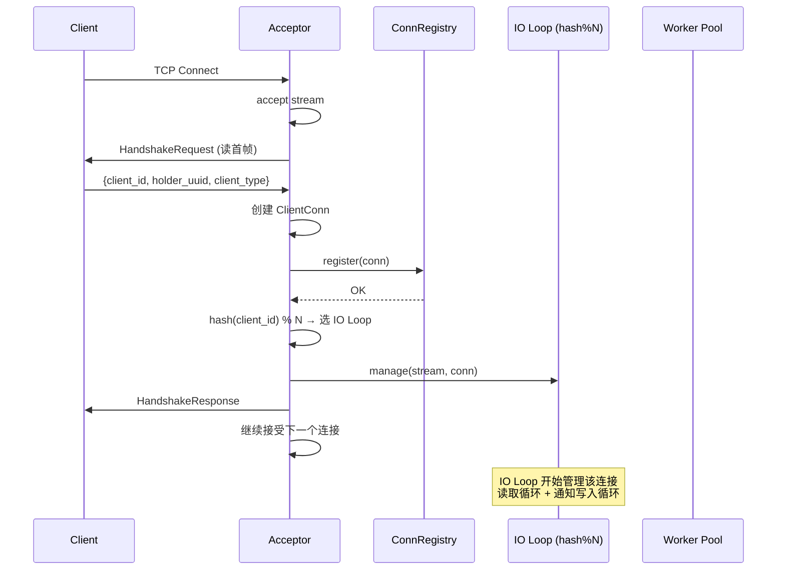
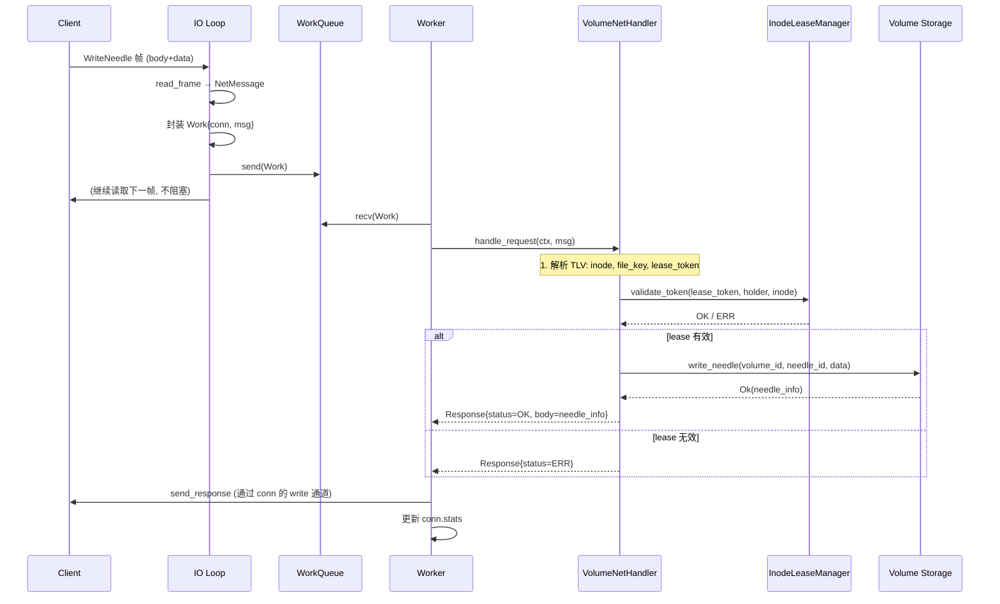
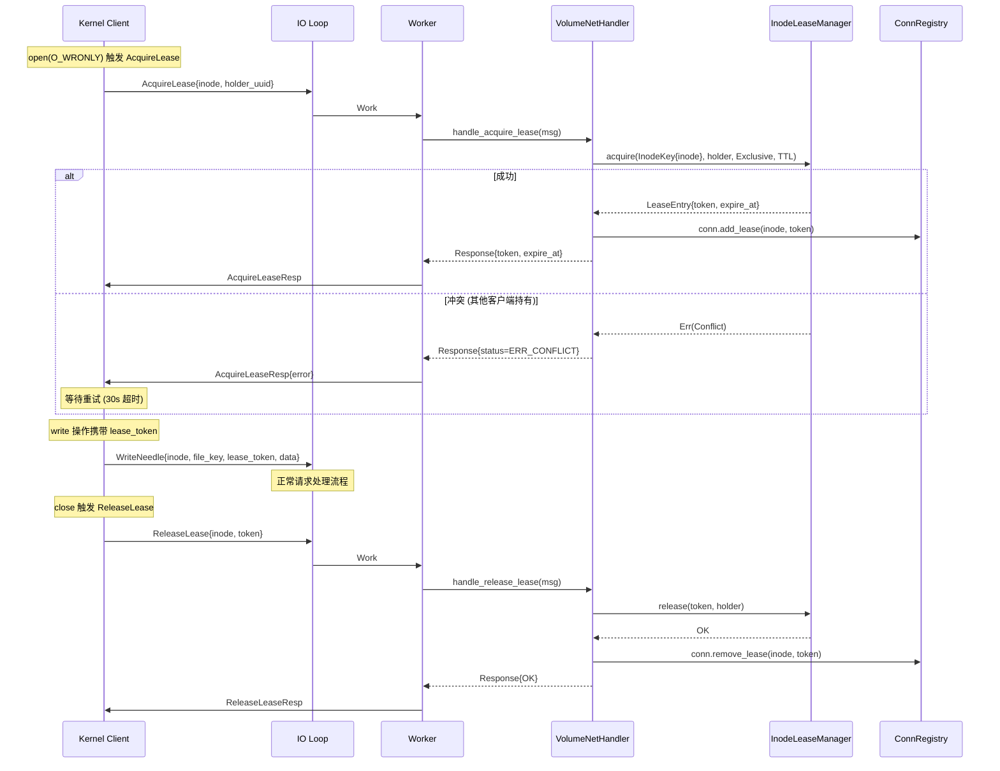
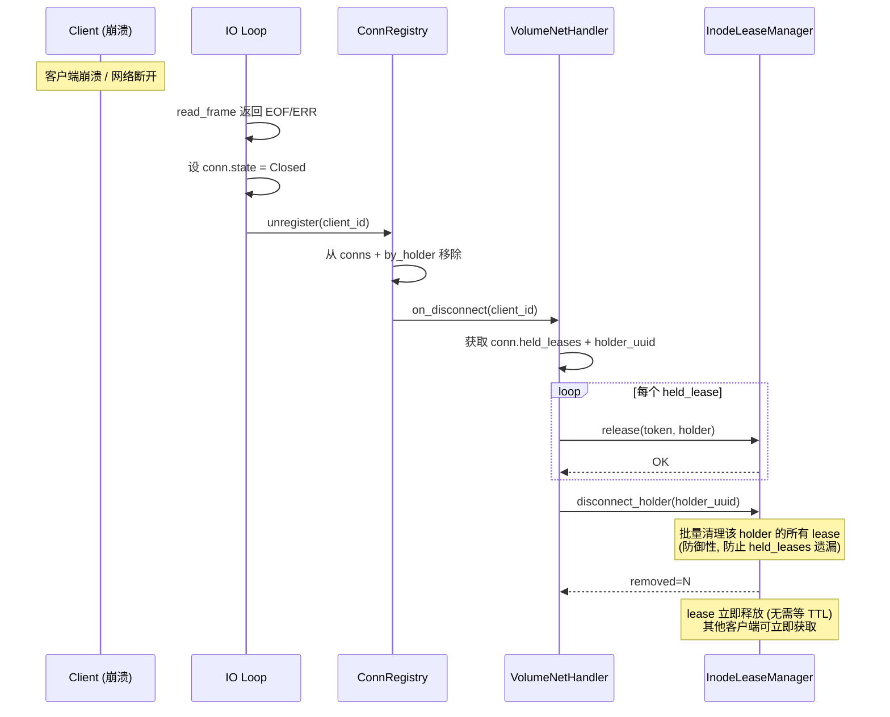
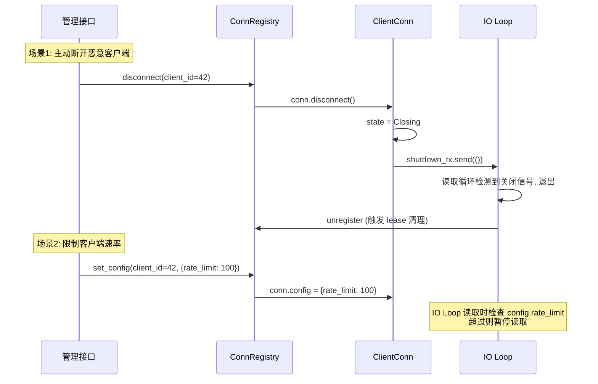

# Volume Server 网络层重构设计

> **状态**: Phase 1 已实施
> **日期**: 2026-08-06
> **目标**: 重构 volume server 网络层，支持千级客户端、结构化连接管理、inode lease

---

## 1. 背景与目标

### 1.1 问题

当前 volume server 网络层采用 tokio `accept → spawn per-conn task` 模型，存在以下问题：

| 问题 | 影响 |
|------|------|
| 千级客户端 → 千个 task | 缺乏结构化管理，无法对特定连接操作 |
| 无 ClientConn 抽象 | 无法终止/配置/查询特定客户端连接 |
| IO 与业务耦合 | 同一 task 既做收发又处理业务，无法独立调度 |
| holder 管理分散 | `client_id_map`(net_handler) vs `ClientSession`(server_connection) vs `lease store` 三处脱节 |
| range lease 无用 | per-stripe lease 粒度不匹配，writepath 未获取 lease |

### 1.2 目标

1. **固定线程数**: IO Loop N + Worker M，不随客户端数增长
2. **ClientConn 抽象**: 每个客户端统一结构，支持 `disconnect(id)` / `set_config(id)` / `list()`
3. **IO 与业务分离**: IO Loop 只收发帧，Worker 处理业务逻辑 + lease
4. **千级扩展**: tokio epoll 多路复用，N 个 IO Loop 管理数千连接
5. **统一 holder 管理**: 移除 `client_id_map`，ClientConn.holder_uuid 统一

### 1.3 设计约束

- 保留 tokio 异步 IO（已是 epoll 驱动，非 per-conn thread）
- 兼容现有 `ServerRequestHandler` trait
- 兼容现有 `NetMessage` / `FrameHeader` 协议
- 不引入 unsafe 代码

---

## 2. 参考架构

### 2.1 BeeGFS 三层模型

```
ConnAcceptor (1线程)     → accept 连接，写入管道
StreamListenerV2 (N线程) → epoll 多路复用读取数据，生成 Work，入 MultiWorkQueue
Worker (M线程)           → 从 WorkQueue 取 Work 处理业务
```

**关键设计**:
- 固定线程数（N+M），不随连接数增长
- epoll 多路复用，一个 StreamListener 管理多个连接
- Work 队列解耦 IO 与业务
- 可配置 `numStreamListeners` 和 `numWorkers`

### 2.2 内核端 per-CPT scheduler（Lustre socklnd 风格）

```
sk_data_ready 回调     → set flag + list_add + wake_up (softirq, 仅标记)
per-CPT scheduler kthread → wait_event → pfs_process_receive / pfs_process_transmit
```

**关键设计**:
- per-CPU scheduler kthread（固定 = CPU 数）
- 哈希路由: `pfs_pick_sched(hash)` 按连接哈希分配调度器
- 回调驱动: socket 回调只标记，调度器线程处理实际收发
- 双层池: filer（元数据）和 volume（数据）独立调度器

### 2.3 对应关系

| BeeGFS | 内核端 | 本方案 | 作用 |
|--------|--------|--------|------|
| ConnAcceptor | accept socket | Acceptor | 接受连接 |
| StreamListenerV2 (epoll) | per-CPT scheduler kthread | IO Loop (tokio task) | 多路复用读写 |
| MultiWorkQueue | sched->waitq + tx_queue | WorkQueue (mpsc) | 解耦 IO 与业务 |
| Worker (PThread) | pfs_scheduler_thread 处理 | Worker (tokio task) | 业务处理 |
| StreamConn | powerfs_net_server_conn | **ClientConn** | 客户端抽象 |

---

## 3. 架构设计

### 3.1 总体架构

```
┌─────────────────────────────────────────────────────────┐
│                    Volume Server                         │
│                                                          │
│  ┌─────────────┐                                        │
│  │  Acceptor   │  tokio TcpListener::accept (1个)       │
│  └──────┬──────┘                                        │
│         │ 新连接                                         │
│         │ 1. 握手 → 获取 client_id + holder_uuid         │
│         │ 2. 创建 ClientConn                             │
│         │ 3. 注册到 ConnRegistry                         │
│         │ 4. 分配到 IO Loop (hash % N)                  │
│         │                                                │
│  ┌──────▼──────────────────────────────────────────┐    │
│  │           ConnRegistry (全局, DashMap)            │    │
│  │  client_id    → Arc<ClientConn>                  │    │
│  │  holder_uuid  → client_id                        │    │
│  │  方法: register / unregister / get / disconnect  │    │
│  │        set_config / list / get_by_holder         │    │
│  └──────┬──────────┬──────────┬────────────────────┘    │
│         │          │          │                          │
│  ┌──────▼────┐┌────▼─────┐┌──▼───────┐                  │
│  │ IO Loop 0 ││IO Loop 1 ││IO Loop N │ (固定N, tokio)   │
│  │ epoll读写 ││epoll读写 ││epoll读写 │ 仅收发帧          │
│  └──────┬────┘└────┬─────┘└──┬───────┘                  │
│         │          │          │ 收到完整帧 → Work         │
│         └──────────┼──────────┘                          │
│                    ▼                                     │
│           ┌─────────────────┐                            │
│           │   WorkQueue     │  mpsc channel (有界)       │
│           └───────┬─────────┘                            │
│                   │                                      │
│         ┌─────────┼─────────┐                            │
│         ▼         ▼         ▼                            │
│    ┌─────────┐┌─────────┐┌─────────┐                    │
│    │Worker 0 ││Worker 1 ││Worker M │ (固定M, tokio)     │
│    │业务处理 ││业务处理 ││业务处理 │ handle_request       │
│    │+ lease  ││+ lease  ││+ lease  │ + lease 操作       │
│    └─────────┘└─────────┘└─────────┘                    │
│                                                          │
│  ┌─────────────────────────────────────────────────┐    │
│  │           InodeLeaseManager (lease store)         │    │
│  │  InodeKey(inode) → LeaseEntry                    │    │
│  │  holder_index: holder → tokens (快速断连清理)     │    │
│  │  cleanup task: 每5s 清理过期 lease                │    │
│  └─────────────────────────────────────────────────┘    │
└─────────────────────────────────────────────────────────┘
```

### 3.2 分层职责

| 层 | 组件 | 职责 | 线程模型 |
|----|------|------|----------|
| L0 | Acceptor | accept + 握手 + 创建 ClientConn | 1 tokio task |
| L1 | ConnRegistry | 连接注册/查找/管理 | 无线程(数据结构) |
| L2 | IO Loop | epoll 读写 + 帧解析 → Work | N tokio task |
| L3 | WorkQueue | 有界 FIFO 队列 | mpsc channel |
| L4 | Worker | handle_request + lease 操作 | M tokio task |
| L5 | InodeLeaseManager | lease 存储与校验 | 无线程(数据结构) + cleanup task |

### 3.3 配置参数

```toml
[network]
# IO Loop 数量 (默认 = CPU 核数)
num_io_loops = 4
# Worker 数量 (默认 = CPU 核数 × 2)
num_workers = 8
# WorkQueue 容量 (有界, 防止积压)
work_queue_capacity = 4096
# 每连接通知通道容量
notify_channel_size = 64
```

---

## 4. 核心结构定义

### 4.1 ClientConn（客户端抽象）

```rust
// powerfs-net/src/client_conn.rs

use std::collections::HashSet;
use std::net::SocketAddr;
use std::sync::Arc;
use std::time::Instant;
use tokio::sync::{mpsc, RwLock};
use dashmap::DashMap;

/// 连接状态
#[derive(Debug, Clone, Copy, PartialEq, Eq)]
pub enum ConnState {
    /// 活跃: 正常收发
    Active,
    /// 挂起: 暂停收发 (限流/熔断)
    Suspended,
    /// 关闭中: 停止接收, 发送剩余响应
    Closing,
    /// 已关闭: 资源待清理
    Closed,
}

/// 客户端配置 (可动态修改)
#[derive(Debug, Clone)]
pub struct ClientConfig {
    /// 请求优先级 (0=最高)
    pub priority: u8,
    /// 速率限制 (req/s, 0=不限)
    pub rate_limit: u32,
    /// 最大并发请求
    pub max_concurrent: u16,
}

impl Default for ClientConfig {
    fn default() -> Self {
        Self {
            priority: 8,
            rate_limit: 0,
            max_concurrent: 64,
        }
    }
}

/// 客户端统计
#[derive(Debug, Clone, Default)]
pub struct ClientStats {
    pub request_count: u64,
    pub error_count: u64,
    pub bytes_sent: u64,
    pub bytes_recv: u64,
    pub connected_at: Instant,
    pub last_activity: Instant,
}

/// 抽象客户端连接
///
/// 每个客户端一个, 统一管理连接状态和资源.
/// 支持: disconnect() / set_config() / get_stats() / 查询 held_leases
#[derive(Debug)]
pub struct ClientConn {
    /// 客户端 ID (握手时分配)
    pub id: u64,
    /// Holder UUID (lease 持有者标识, 替代 client_id_map)
    pub holder_uuid: RwLock<Option<String>>,
    /// 客户端地址
    pub addr: SocketAddr,
    /// 客户端类型 (FUSE/Kernel/Master/Filer/Volume)
    pub client_type: ClientType,

    /// 连接状态 (原子操作, 无锁读)
    pub state: RwLock<ConnState>,
    /// 客户端配置 (可动态修改)
    pub config: RwLock<ClientConfig>,
    /// 客户端统计
    pub stats: RwLock<ClientStats>,

    /// 持有的 inode lease 列表 (快速断连清理)
    pub held_leases: RwLock<HashSet<u64>>,
    /// 持有的 lease token 列表
    pub held_tokens: RwLock<HashSet<String>>,

    /// 通知推送通道 (server → client, 用于 Invalidate 等)
    pub notify_tx: mpsc::Sender<NetMessage>,
    /// 关闭句柄 (用于主动断开底层 TCP 连接)
    pub close_handle: RwLock<Option<CloseHandle>>,
}

/// 关闭句柄 (封装底层连接的关闭操作)
#[derive(Clone)]
pub struct CloseHandle {
    /// 关闭 TCP stream 的发送端
    shutdown_tx: mpsc::Sender<()>,
}

impl CloseHandle {
    pub async fn shutdown(&self) {
        let _ = self.shutdown_tx.send(()).await;
    }
}

impl ClientConn {
    pub fn new(
        id: u64,
        addr: SocketAddr,
        client_type: ClientType,
        notify_tx: mpsc::Sender<NetMessage>,
    ) -> Arc<Self> {
        let now = Instant::now();
        Arc::new(Self {
            id,
            holder_uuid: RwLock::new(None),
            addr,
            client_type,
            state: RwLock::new(ConnState::Active),
            config: RwLock::new(ClientConfig::default()),
            stats: RwLock::new(ClientStats {
                connected_at: now,
                last_activity: now,
                ..Default::default()
            }),
            held_leases: RwLock::new(HashSet::new()),
            held_tokens: RwLock::new(HashSet::new()),
            notify_tx,
            close_handle: RwLock::new(None),
        })
    }

    /// 设置 holder UUID (握手后调用)
    pub async fn set_holder(&self, holder: String) {
        *self.holder_uuid.write().await = Some(holder);
    }

    /// 添加持有的 lease
    pub async fn add_lease(&self, inode: u64, token: String) {
        self.held_leases.write().await.insert(inode);
        self.held_tokens.write().await.insert(token);
    }

    /// 移除持有的 lease
    pub async fn remove_lease(&self, inode: u64, token: &str) {
        self.held_leases.write().await.remove(&inode);
        self.held_tokens.write().await.remove(token);
    }

    /// 主动断开连接
    pub async fn disconnect(&self) {
        {
            let mut state = self.state.write().await;
            *state = ConnState::Closing;
        }
        if let Some(handle) = self.close_handle.read().await.as_ref() {
            handle.shutdown().await;
        }
    }

    /// 更新活动时间
    pub async fn touch(&self) {
        self.stats.write().await.last_activity = Instant::now();
    }
}
```

### 4.2 ConnRegistry（连接注册表）

```rust
// powerfs-net/src/client_conn.rs

/// 全局连接注册表 (替代分散的 client_id_map + sessions)
///
/// 线程安全, 使用 DashMap 支持高并发读写.
/// 提供: register / unregister / get / disconnect / set_config / list
pub struct ConnRegistry {
    /// client_id → ClientConn
    conns: DashMap<u64, Arc<ClientConn>>,
    /// holder_uuid → client_id (lease 校验时用)
    by_holder: DashMap<String, u64>,
}

impl ConnRegistry {
    pub fn new() -> Self {
        Self {
            conns: DashMap::new(),
            by_holder: DashMap::new(),
        }
    }

    /// 注册新连接
    pub async fn register(&self, conn: Arc<ClientConn>) {
        let id = conn.id;
        if let Some(holder) = conn.holder_uuid.read().await.as_ref() {
            self.by_holder.insert(holder.clone(), id);
        }
        self.conns.insert(id, conn);
    }

    /// 注销连接 (断连时调用, 清理 lease)
    pub async fn unregister(&self, id: u64) -> Option<Arc<ClientConn>> {
        let conn = self.conns.remove(&id).map(|(_, c)| c)?;
        if let Some(holder) = conn.holder_uuid.read().await.as_ref() {
            self.by_holder.remove(holder);
        }
        Some(conn)
    }

    /// 获取连接
    pub fn get(&self, id: u64) -> Option<Arc<ClientConn>> {
        self.conns.get(&id).map(|r| r.value().clone())
    }

    /// 通过 holder UUID 获取连接
    pub fn get_by_holder(&self, holder: &str) -> Option<Arc<ClientConn>> {
        let id = *self.by_holder.get(holder)?;
        self.get(id)
    }

    /// 主动断开指定连接
    pub async fn disconnect(&self, id: u64) -> bool {
        if let Some(conn) = self.get(id) {
            conn.disconnect().await;
            true
        } else {
            false
        }
    }

    /// 设置客户端配置
    pub async fn set_config(&self, id: u64, config: ClientConfig) -> bool {
        if let Some(conn) = self.get(id) {
            *conn.config.write().await = config;
            true
        } else {
            false
        }
    }

    /// 列出所有连接信息 (管理/监控)
    pub async fn list(&self) -> Vec<ClientInfo> {
        self.conns
            .iter()
            .map(|r| {
                let conn = r.value();
                ClientInfo {
                    id: conn.id,
                    addr: conn.addr,
                    client_type: conn.client_type,
                    state: *conn.state.read().await,
                }
            })
            .collect()
    }

    /// 活跃连接数
    pub fn active_count(&self) -> usize {
        self.conns.len()
    }
}

/// 客户端信息摘要 (用于 list() 返回)
#[derive(Debug, Clone)]
pub struct ClientInfo {
    pub id: u64,
    pub addr: SocketAddr,
    pub client_type: ClientType,
    pub state: ConnState,
}
```

### 4.3 Work（请求封装）

```rust
// powerfs-net/src/work.rs

use std::sync::Arc;
use crate::client_conn::ClientConn;
use powerfs_net::NetMessage;

/// IO Loop → Worker 的请求封装
#[derive(Debug)]
pub struct Work {
    /// 客户端连接 (Arc 引用, Worker 可查/改状态)
    pub conn: Arc<ClientConn>,
    /// 收到的请求消息
    pub msg: NetMessage,
    /// 接收时间 (用于延迟统计)
    pub recv_at: Instant,
}
```

### 4.4 IoLoop（IO 循环）

```rust
// powerfs-net/src/io_loop.rs

use std::sync::Arc;
use tokio::net::TcpStream;
use tokio::sync::mpsc;

/// IO Loop (固定数量, 每个管理一批连接的读写)
///
/// 职责:
///   - 从分配的连接读取帧 (tokio async read)
///   - 解析帧为 NetMessage
///   - 封装为 Work 推送到 WorkQueue
///   - 从连接的 notify_rx 读取通知并写入 TCP
///
/// 不处理业务逻辑, 只做 IO 收发.
pub struct IoLoop {
    pub id: usize,
    /// 推送到 WorkQueue 的发送端
    work_tx: mpsc::Sender<Work>,
}

impl IoLoop {
    pub fn new(id: usize, work_tx: mpsc::Sender<Work>) -> Self {
        Self { id, work_tx }
    }

    /// 管理一个连接 (tokio task)
    ///
    /// 连接按 hash % N 分配到 IO Loop.
    /// 每个 IO Loop 内可有多个连接 (tokio 多路复用).
    pub async fn manage(&self, stream: TcpStream, conn: Arc<ClientConn>) {
        let (read_half, mut write_half) = stream.into_split();
        let work_tx = self.work_tx.clone();

        // 设置 close_handle
        let (shutdown_tx, mut shutdown_rx) = mpsc::channel::<()>(1);
        conn.close_handle.write().await = Some(CloseHandle { shutdown_tx });

        // 读取循环
        let read_conn = conn.clone();
        let read_task = tokio::spawn(async move {
            let mut reader = read_half;
            loop {
                // 检查关闭信号
                if shutdown_rx.try_recv().is_ok() {
                    break;
                }
                // 检查连接状态
                if *read_conn.state.read().await == ConnState::Closing {
                    break;
                }
                // 读取帧
                match Self::read_frame(&mut reader).await {
                    Ok(msg) => {
                        read_conn.touch().await;
                        read_conn.stats.write().await.request_count += 1;
                        let work = Work {
                            conn: read_conn.clone(),
                            msg,
                            recv_at: Instant::now(),
                        };
                        if work_tx.send(work).await.is_err() {
                            break; // WorkQueue 关闭
                        }
                    }
                    Err(e) => {
                        read_conn.stats.write().await.error_count += 1;
                        break;
                    }
                }
            }
        });

        // 通知写入循环 (server → client push)
        let mut notify_rx = conn.notify_rx.subscribe(); // 或直接用 receiver
        let write_task = tokio::spawn(async move {
            while let Ok(notify_msg) = notify_rx.recv().await {
                if let Err(_) = Self::write_frame(&mut write_half, &notify_msg).await {
                    break;
                }
            }
        });

        // 等待任一结束
        tokio::select! {
            _ = read_task => {}
            _ = write_task => {}
        }

        // 连接断开, 触发清理
        *conn.state.write().await = ConnState::Closed;
    }

    async fn read_frame(reader: &mut tokio::io::ReadHalf<TcpStream>) -> Result<NetMessage, NetError> {
        // 复用现有帧读取逻辑 (header + body + data)
        // ...
    }

    async fn write_frame(writer: &mut tokio::io::WriteHalf<TcpStream>, msg: &NetMessage) -> Result<(), NetError> {
        // 复用现有 build_frame + write_all
        // ...
    }
}
```

### 4.5 Worker（业务处理）

```rust
// powerfs-net/src/worker.rs

use std::sync::Arc;
use tokio::sync::mpsc;

/// Worker (固定数量, 处理业务逻辑)
///
/// 职责:
///   - 从 WorkQueue 取 Work
///   - 调用 handler.handle_request()
///   - 写回响应到连接
///   - lease 操作 (acquire/release/validate)
pub struct Worker {
    pub id: usize,
    work_rx: mpsc::Receiver<Work>,
    handler: Arc<dyn ServerRequestHandler>,
    registry: Arc<ConnRegistry>,
}

impl Worker {
    pub fn new(
        id: usize,
        work_rx: mpsc::Receiver<Work>,
        handler: Arc<dyn ServerRequestHandler>,
        registry: Arc<ConnRegistry>,
    ) -> Self {
        Self { id, work_rx, handler, registry }
    }

    pub async fn run(mut self) {
        while let Some(work) = self.work_rx.recv().await {
            let conn = &work.conn;

            // 检查连接状态
            if *conn.state.read().await == ConnState::Closed {
                continue;
            }

            // 处理请求
            let result = self.handler.handle(
                &mut RequestContext::new(conn.clone()),
                &work.msg,
            ).await;

            // 写回响应
            match result {
                Ok(resp) => {
                    if let Err(e) = conn.send_response(&resp).await {
                        warn!("Worker {} send response failed: {}", self.id, e);
                    }
                }
                Err(e) => {
                    warn!("Worker {} handle error: {}", self.id, e);
                }
            }

            // 更新统计
            let mut stats = conn.stats.write().await;
            stats.last_activity = Instant::now();
        }
    }
}
```

### 4.6 InodeLeaseManager（inode lease 管理）

```rust
// powerfs-volume/src/inode_lease.rs

use powerfs_lease::{LeaseKey, LeaseMode, LeaseEntry};
use std::time::Duration;

/// Inode lease 的 key (per-inode, 替代 StripeKey)
#[derive(Clone, Eq, PartialEq, Hash)]
pub struct InodeKey {
    pub inode: u64,
}

impl LeaseKey for InodeKey {
    fn group_id(&self) -> u64 {
        self.inode  // 不同 inode 不冲突
    }

    fn conflicts(&self, other: &Self) -> bool {
        self.inode == other.inode  // 同 inode 互斥 (exclusive lease)
    }

    fn encode(&self) -> Vec<u8> {
        self.inode.to_le_bytes().to_vec()
    }

    fn decode(data: &[u8]) -> Result<Self, powerfs_lease::LeaseError> {
        let inode = u64::from_le_bytes(data.try_into().map_err(|_| {
            powerfs_lease::LeaseError::InvalidKey("bad inode key".into())
        })?);
        Ok(Self { inode })
    }
}

/// Inode lease 管理器 (基于 powerfs-lease MemoryLeaseStore)
pub type InodeLeaseManager = RangeLeaseManager<InodeKey>;

/// 默认 lease TTL
pub const INODE_LEASE_TTL: Duration = Duration::from_secs(15);
/// 默认 cleanup grace period
pub const INODE_LEASE_GRACE: Duration = Duration::from_secs(5);
```

---

## 5. 流程时序图

### 5.1 连接建立



### 5.2 请求处理（WriteNeedle 为例）



### 5.3 Lease Acquire/Release



### 5.4 断连清理



### 5.5 主动断连/配置



---

## 6. 与现有代码的对应关系

### 6.1 文件映射

| 现有文件 | 现有组件 | 新方案 | 操作 |
|----------|----------|--------|------|
| `server.rs` NetServer | accept + per-conn task | Acceptor + IoLoop + Worker | 重构 |
| `server_connection.rs` ClientSession | 连接状态 | ClientConn | 增强 |
| `server_connection.rs` ServerConnectionManager | sessions HashMap | ConnRegistry | 替代 |
| `net_handler.rs` client_id_map | session→uuid 映射 | ClientConn.holder_uuid | 移除(合并) |
| `net_handler.rs` on_disconnect | 断连清理 | ConnRegistry.unregister | 增强 |
| `range_lease.rs` StripeKey | per-stripe lease | InodeKey | 替代 |
| `range_lease.rs` RangeLeaseManager | lease 管理 | InodeLeaseManager | 重命名 |

### 6.2 数据流对比

**现有**:
```
accept → spawn task → { read_frame → handle_request → send_response } per-conn
                         ↑ client_id_map 查 holder  ↑ lease_mgr 分散
```

**新方案**:
```
accept → create ClientConn → register ConnRegistry
       → assign IO Loop (hash%N)
       → IO Loop: read_frame → Work → WorkQueue
       → Worker: recv Work → handle_request (查 ClientConn) → send_response
       → disconnect: unregister → on_disconnect → cleanup lease
```

---

## 7. 实施路径

### Phase 1: 核心结构 (无功能变更)

**目标**: 定义新结构, 不改变现有行为

1. 新建 `powerfs-net/src/client_conn.rs`: ClientConn + ConnRegistry
2. 新建 `powerfs-net/src/work.rs`: Work 封装
3. 新建 `powerfs-net/src/io_loop.rs`: IoLoop (复用现有 read_frame)
4. 新建 `powerfs-net/src/worker.rs`: Worker (复用现有 handler)
5. 单元测试: ClientConn 生命周期 + ConnRegistry 操作

### Phase 2: 网络层切换

**目标**: 用新架构替换现有 accept → spawn 模型

1. 改造 `server.rs`: Acceptor 创建 ClientConn → 注册 → 分配 IoLoop
2. 实现 IoLoop.manage(): read 循环 → Work → WorkQueue
3. 实现 Worker.run(): recv Work → handle → send_response
4. 移除 `server_connection.rs` 的 per-conn task 逻辑
5. 集成测试: 多客户端连接 + 请求处理

### Phase 3: 统一 holder 管理

**目标**: 移除 client_id_map, 统一到 ClientConn

1. 握手时设置 `ClientConn.holder_uuid`
2. `handle_write_needle` 从 ClientConn 获取 holder (替代 client_id_map)
3. `on_disconnect` 从 ClientConn 获取 held_leases
4. 移除 `net_handler.rs` 的 `client_id_map`
5. 测试: lease 操作 + 断连清理

### Phase 4: InodeLeaseManager

**目标**: 用 InodeKey 替代 StripeKey

1. 新建 `powerfs-volume/src/inode_lease.rs`: InodeKey + InodeLeaseManager
2. 新增 `handle_acquire_lease` / `handle_release_lease` net handler
3. 新增 `AcquireLease` / `ReleaseLease` 消息类型
4. ClientConn.add_lease / remove_lease 联动
5. 测试: lease acquire/release/conflict/disconnect cleanup

### Phase 5: 管理接口

**目标**: 支持主动断连/配置

1. 新增 HTTP API: `GET /clients` / `DELETE /clients/{id}` / `PUT /clients/{id}/config`
2. IoLoop 读取时检查 config.rate_limit
3. 测试: 主动断连 + 限速

---

## 8. 风险评估

| 风险 | 等级 | 缓解措施 |
|------|------|----------|
| WorkQueue 积压导致延迟 | 中 | 有界队列 + 背压 (满了暂停读取) |
| IO Loop 单点瓶颈 | 低 | hash%N 分散, 可配置 N |
| Worker 处理慢导致饿死 | 中 | 限制 per-conn 并发 + 优先级队列 |
| lease 释放竞态 (close vs writeback) | 高 | release 带 grace period |
| 协议兼容性 | 低 | 保留现有 NetMessage/FrameHeader |

---

## 9. 性能预期

| 指标 | 现有 | 预期 |
|------|------|------|
| 最大客户端数 | ~500 (task 开销) | ~5000+ (固定线程) |
| 请求延迟 (P99) | ~2ms | ~1ms (IO/业务分离) |
| 内存/连接 | ~50KB (task stack) | ~5KB (ClientConn) |
| 断连清理延迟 | 35s (TTL+grace) | <1s (主动清理) |
| lease 冲突检测 | N/A (无 lease) | <0.1ms (InodeKey 哈希) |

---

## 附录 A: 现有 ClientSession 结构 (参考)

```rust
// server_connection.rs:80 (现有)
pub struct ClientSession {
    pub client_id: u64,
    pub client_type: ClientType,
    pub address: SocketAddr,
    pub state: SessionState,
    pub connected_at: Instant,
    pub last_activity: Instant,
    pub request_count: u64,
    pub error_count: u64,
    pub rate_limiter: RateLimiter,
}
```

**vs ClientConn 改进**:
- 新增 `holder_uuid` (统一 holder 管理)
- 新增 `held_leases` / `held_tokens` (lease 追踪)
- 新增 `config` (可动态配置)
- 新增 `close_handle` (主动断开)
- 新增 `notify_tx` (通知推送)
- `state` 改为 RwLock<ConnState> (原子状态转换)

## 附录 B: 内核端调度器结构 (参考)

```c
// powerfs_net.c (内核端)
struct powerfs_net_sched {
    int cpt;                          /* CPU partition ID */
    struct task_struct *task;          /* scheduler kthread */
    wait_queue_head_t waitq;           /* 唤醒队列 */
    struct list_head rx_queue;         /* 待接收连接 */
    spinlock_t rx_lock;
    struct list_head tx_queue;         /* 待发送请求 */
    spinlock_t tx_lock;
};

static int pfs_scheduler_thread(void *arg) {
    while (!kthread_should_stop()) {
        wait_event_interruptible(sched->waitq, !list_empty(&sched->rx_queue));
        pfs_process_receive(conn);    /* 收 */
        pfs_process_transmit(conn);   /* 发 */
    }
}
```

**对应关系**:
- `powerfs_net_sched` → IoLoop + Worker
- `rx_queue/tx_queue` → WorkQueue (mpsc)
- `waitq` → mpsc::recv (async)
- `kthread` → tokio task

---

## 附录 C: TLV 标准化 (gRPC → TLV 迁移)

> **目标**: 审查所有服务间通信，统一到 TLV 协议。gRPC 仅保留用于监控功能，其余通信全部采用 powerfs-net 通信架构与协议。

### C.1 迁移范围与阶段

| 阶段 | 内容 | 传输路径 | 状态 |
|------|------|----------|------|
| Phase B | Filer Raft 节点间通信 | gRPC → TLV `MsgType::RaftMessage` | ✅ 完成 |
| Phase B | Filer 节点注册 (Zone 分配) | gRPC ResilientMasterClient → TLV `MsgType::RegisterFiler` | ✅ 完成 |
| Phase B | Volume 心跳 | gRPC → TLV `MsgType::Heartbeat` | ✅ 完成 |
| Phase D | Master Raft 节点间通信 | gRPC `RaftService` → TLV `MsgType::RaftMessage` | ✅ 完成 |

### C.2 Phase D: Master Raft TLV 迁移

**替换前** (gRPC):
- `RaftGrpcServer` 注册在 master gRPC server (与 `MasterService` 同端口)
- `RaftGrpcClient::send_raft_message` 通过 gRPC 发送 eraftpb::Message
- Master 启动时 spawn gRPC forwarder 消费 `message_tx` broadcast

**替换后** (TLV):
- `MasterNetHandler::handle_raft_message` 处理 `MsgType::RaftMessage` (TLV server 侧)
- `send_tlv_raft_message()` 自由函数: TCP 连接 → powerfs-net 握手 → 发送 TLV 帧 → 读响应 (TLV client 侧)
- Master forwarder 改用 `send_tlv_raft_message`，通过 peer `net_address` 发送

**协议字段** (`MsgType::RaftMessage`):
| FieldId | 类型 | 说明 |
|---------|------|------|
| `ShardId` (0x9A) | u64 | 分片 ID (Master 单组 Raft, 固定 0; Filer 多分片使用实际 shard_id) |
| `RaftPayload` (0x9E) | bytes | 序列化的 `eraftpb::Message` (protobuf) |

**关键改动文件**:
- `powerfs-net/src/protocol.rs`: 新增 `ClientType::Master = 0x06` (Master 作为 TLV client 发送 Raft 时使用)
- `powerfs-master/src/raft_node.rs`: `Peer` 结构新增 `net_address` 字段 (ip:net_port)
- `powerfs-master/src/master.rs`:
  - `MasterNode::new`: 从 peer gRPC 地址 (ip:port) 派生 `net_address` (ip:net_port)
  - 新增 `send_tlv_raft_message()`: TLV Raft 客户端
  - forwarder 改用 TLV; gRPC server 移除 `RaftServiceServer` 注册
- `powerfs-master/src/net_handler.rs`: 新增 `handle_raft_message()` + dispatch 注册
- `powerfs-master/src/raft_server.rs`: `send_raft_message` gRPC handler 标记废弃 (返回错误, 保留 proto 兼容)

### C.3 gRPC 保留范围 (仅监控)

Master gRPC server 仅保留 `MasterService` (监控/管理 RPC):
- `get_cluster_info`, `get_master_status`, `get_statistics`
- `volume_list`, `get_collection_stats`, `get_fuse_clients`
- `get_shard_mapping`, `list_filers`
- 冲突检测/管理 RPCs

废弃的 gRPC (已迁移到 TLV):
- `RaftService::send_raft_message` → TLV `MsgType::RaftMessage`
- `MasterService::send_heartbeat` → TLV `MsgType::Heartbeat` (Volume → Master)
- `MasterService::register_filer` → TLV `MsgType::RegisterFiler` (Filer → Master)

### C.4 待迁移项 (Phase C 后续)

| 通信路径 | 当前协议 | 目标 | 说明 |
|----------|----------|------|------|
| Master → Volume (create_volume, write/read/delete_needle) | gRPC `VolumeService` | TLV | Master 调用 Volume 的数据操作 |
| fsck 工具 → Master/Filer | gRPC | TLV | 孤儿 chunk 修复工具 |
| S3 → Master | gRPC | 评估 | S3 网关元数据操作 |

### C.5 验证

- `cargo check --workspace`: ✅ 全部通过
- `cargo test -p powerfs-master --lib`: ✅ 97 passed (raft 相关测试全部通过)
- 预存失败: 5 个 S3 测试 (需运行中的 master gRPC, 连接拒绝) + 2 个 e2e config 测试 (TOML 缺少 `master_net_port` 字段, Phase B 遗留)

---

## 附录 D: 网络层接口统一与模块解耦

> **目标**: 统一 `powerfs-net` 内部接口，为上层服务 (Master/Filer/Volume) 提供一致的消费 API；消除重复代码与泄漏抽象，提升模块稳定性。
>
> **决策**: 全 4 层 (A+B+C+D)；handler trait 合并采用硬中断 (删除 `PowerFsNetHandler` + `LegacyHandler`，无 deprecation 期)。

### D.1 问题清单 (审计结果)

| # | 问题 | 影响 |
|---|------|------|
| 1 | **TLV 客户端传输 4× 重复** | Master/Filer 各自实现 `send_tlv_raft_message`；Filer `zone_client`、Volume `master_client` 各自重复 connect→handshake→frame→read。`PowerFsNetClient` 已存在却被绕过 |
| 2 | **两套 handler trait 并存** | `PowerFsNetHandler` (server.rs) 与 `ServerRequestHandler` (server_connection.rs) 概念重叠，靠 `handler_adapter.rs` 桥接，契约不清 |
| 3 | **泄漏抽象** | `inode_notifier.rs` 直接 import `protocol::{FrameFlags,FrameHeader,MsgType,NetMessage}` + `serialize::TlvEncoder` + `FieldId` 手工拼帧；各 `net_handler.rs` 手工构造响应帧 |
| 4 | **命名冲突** | `client.rs::ClientConfig` 与 `client_conn.rs::ClientConfig` (别名 `ClientConnConfig`) 同时导出 |

### D.2 统一方案

#### Layer A — 统一 RPC 客户端 (`NetRpcClient`)

新增 `powerfs-net/src/rpc_client.rs`，封装 connect→handshake→frame→read，对外提供两种语义：

```rust
/// 一次性 RPC (低频: Raft, RegisterFiler) — 每次新建短连接
pub async fn call_once(
    addr: &str,
    client_type: ClientType,
    msg_type: MsgType,
    body: &[u8],
) -> NetResult<RpcReply>;

/// 持久连接 RPC (高频: Heartbeat) — 复用连接
pub struct NetRpcClient { /* inner: PowerFsNetClient 或轻量自管 */ }
pub async fn connect(addr, client_type, cfg) -> NetResult<Self>;
pub async fn call(&self, msg_type, body) -> NetResult<RpcReply>;

pub struct RpcReply { pub status: u16, pub body: Vec<u8> }
```

替换:
- `powerfs-master/src/master.rs::send_tlv_raft_message` → `NetRpcClient::call_once`
- `powerfs-filer/src/raft_group_manager.rs::send_tlv_raft_message` → `NetRpcClient::call_once`
- `powerfs-filer/src/zone_client.rs::register_filer` 内部传输 → `NetRpcClient::call_once` (保留 REDIRECT 循环在上层)
- `powerfs-volume/src/master_client.rs::send_heartbeat_once` 内部传输 → `NetRpcClient::call_once`

#### Layer B — 单一 Handler Trait (`NetHandler`)

合并 `PowerFsNetHandler` + `ServerRequestHandler` 为单一 trait:

```rust
#[async_trait::async_trait]
pub trait NetHandler: Send + Sync {
    async fn handle(&self, ctx: &RequestContext, msg: &NetMessage) -> NetResult<NetMessage>;
    async fn on_connect(&self, _ctx: &RequestContext) {}
    async fn on_disconnect(&self, _client_id: u64) {}
}
```

删除:
- `powerfs-net/src/handler_adapter.rs` (`ManagedNetHandler`, `LegacyHandler`)
- `PowerFsNetHandler` trait (server.rs)
- `ServerRequestHandler` trait (server_connection.rs)

`server.rs` 内部直接调用 `NetHandler`。`ManagedNetHandler` 的 session 管理 + middleware 逻辑下沉到 `server.rs` 的 acceptor/io_loop 路径或 `ServerConnectionManager`。

Master/Filer/Volume `net_handler.rs` 改 `impl NetHandler`。

#### Layer C — 服务端推送 API

`ServerConnectionManager` 新增业务级 (typed) 推送 API，由 net 层内部构建 `NetMessage`，
上层不再触碰 `protocol`/`serialize`/`FieldId`:

```rust
/// Push an Invalidate(inode, version) notification to a single client.
/// Returns Ok(true) if queued, Ok(false) if channel full, Err if no channel.
pub async fn push_invalidate_notification(
    &self,
    client_id: u64,
    inode: u64,
    version: u64,
) -> NetResult<bool>;

/// Broadcast an Invalidate(inode, version) notification to all clients.
/// Returns the number of clients that received the notification.
pub async fn broadcast_invalidate_notification(
    &self,
    inode: u64,
    version: u64,
) -> usize;
```

底层的 `send_notification(client_id, msg)` / `broadcast_notification(&msg)` 仍保留，
供需要自定义 `MsgType` 的调用方 (如 `master.rs` 的 `TopologyChanged`) 使用——但消息
本身也通过 `NetMessage::notification` 构造，不再手工拼 `FrameHeader`。

`inode_notifier.rs` 改用 `push_invalidate_notification` / `broadcast_invalidate_notification`；
已删除 `use powerfs_net::protocol::{FrameFlags, FrameHeader, MsgType, NetMessage}`、
`use powerfs_net::serialize::TlvEncoder`、`use powerfs_net::FieldId` 三处直接 import，
以及私有 `build_invalidate_message` 方法 (逻辑下沉到 `ServerConnectionManager::build_invalidate_message`)。

#### Layer D — 响应/通知构建器

在 `protocol::NetMessage` 上新增 3 个 builder，替代各 handler 手工构造
`FrameHeader` + `FrameFlags` + `NetMessage::new(...).with_body(...)` 的重复样板:

```rust
/// Build a response for `req` with given `status`, `body`, `data`.
/// Copies msg_type + seq from req, sets RESPONSE flag.
pub fn response(req: &NetMessage, status: u16, body: Vec<u8>, data: Vec<u8>) -> NetMessage;

/// Convenience wrapper for STATUS_OK.
pub fn ok_response(req: &NetMessage, body: Vec<u8>, data: Vec<u8>) -> NetMessage;

/// Build a server-pushed notification (NOTIFY flag, seq=0).
pub fn notification(msg_type: MsgType, body: Vec<u8>, data: Vec<u8>) -> NetMessage;
```

**可见性收窄决策**: `FrameHeader`/`FrameFlags`/`build_frame` 暂保持 `pub`。
原计划改为 `pub(crate)` 会破坏 `NetMessage.header` 字段的外部可见性 (多处 handler
读取 `msg.header.msg_type`/`msg.header.seq`)，引入大面积破坏性改动。本次通过
builder 引导上层自愿迁移，已实现"上层服务不再直接 import `FrameFlags`/`FrameHeader`"
的解耦目标；后续如需硬收窄，可在 builder 全面铺开后再做。

**命名冲突**: `client_conn::ClientConfig` 已通过 `lib.rs` 的
`pub use ... as ClientConnConfig` 别名导出，与 `client::ClientConfig` 共存，无需破坏性重命名。

### D.3 实施顺序与验证

| 步骤 | 内容 | 验证 |
|------|------|------|
| 1 | Layer A: `NetRpcClient` + 替换 4 处调用 | `cargo check --workspace` + 各服务 `cargo test --lib` |
| 2 | Layer B: `NetHandler` trait 合并 + 删除 adapter | 同上 |
| 3 | Layer C: `push_invalidate_notification` API + `inode_notifier` 改造 | 同上 |
| 4 | Layer D: 响应/通知构建器 + 上层迁移 | `cargo check --workspace` 全量 |
| 5 | 全量回归 | `cargo test --workspace` |

### D.4 实施结果 (已完成)

**接口统一达成**:
- `powerfs-net/src/protocol.rs`: 新增 `NetMessage::response` / `ok_response` / `notification`，含 5 个单元测试 (`test_response_builder_*` / `test_notification_builder_*`)。
- `powerfs-net/src/server_connection.rs`: 新增 `push_invalidate_notification` / `broadcast_invalidate_notification` + 私有 `build_invalidate_message`。

**上层服务解耦达成** (均已删除 `FrameFlags`/`FrameHeader` 直接 import):
- `powerfs-master/src/net_handler.rs`: `build_response` → `NetMessage::response`；`MsgType::Ping` → `NetMessage::ok_response`。
- `powerfs-filer/src/net_handler.rs`: 同上。
- `powerfs-volume/src/net_handler.rs`: 同上。
- `powerfs-filer/src/inode_notifier.rs`: 改用 `push_invalidate_notification` / `broadcast_invalidate_notification`，删除 `protocol`/`serialize`/`FieldId` import + 私有 message builder；新增 2 个测试覆盖无订阅者与断连清理路径。
- `powerfs-master/src/master.rs`: `TopologyChanged` 广播改用 `NetMessage::notification`。
- `powerfs-fuse/src/invalidate_handler.rs`: 测试 helper 改用 `NetMessage::notification`。

**验证结果**:
- `cargo check --workspace --all-targets`: **PASS**
- `cargo test -p powerfs-net`: 56 passed (含 5 个新 builder 测试)
- `cargo test -p powerfs-filer --lib inode_notifier`: 4 passed (含 2 个新测试)
- `cargo test -p powerfs-fuse --lib invalidate_handler`: 6 passed
- `cargo test -p powerfs-volume --lib`: 18 passed
- `cargo test -p powerfs-master --lib`: 97 passed, 5 failed (S3 测试，需运行中的 gRPC 后端，与本次改动无关——已通过 `git stash` 在基线 commit 上复现同样失败)

**已知无关失败** (非本次改动引入):
- `powerfs-core/tests/volume_test.rs::test_write_needle_blob_growth_updates_used`: 存储层 needle blob 增长计数 bug (powerfs-core 未被本次改动触及)。
- `powerfs-master s3::server::tests` (5 个): 集成测试需连接 gRPC volume/filer 后端，测试环境未启动。
- `powerfs-fuse/tests/concurrent_consistency.rs` (3 个): 集成测试需 spawn 已构建的 master 二进制，环境未安装。


